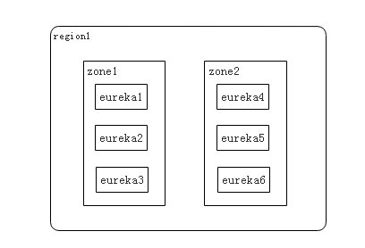

## spring cloud　读书笔记
> Netflix/eureka  wiki https://github.com/Netflix/eureka/wiki

### 服务发现与消费
服务发现的任务由Eureka的客户端完成，而服务消费的任务由Ribbon完成。
Ribbon是一个基千HTTP和TCP的客户端负载均衡器，它可以在通过客户端中配置的ribbonServerList
服务端列表去轮询访问以达到均衡负载的作用。

当Ribbon与Eureka联合使用时，Ribbon的服务实例清单RibbonServerList
会被DiscoveryEnabledNIWSServerList重
写，扩展成从Eureka注册中心中获取服务端列表。同时它也会用NIWSDiscoveryPing
来取代工IPing,它将职责委托给Eureka来确定服务端是否已经启动.

> DiscoveryEnabledNIWSServerList 类在 ribbon-eureka 包中

### ribbon
ribbon 它在Eureka服务发现的基础上，实现了一套对服务实例的选择策略，从而实现对服务的消费.

### 注册中心高可用
Eureka Server的高可用实际上就是将自己作为服务向其他服务注册中心注册自己，这
样就可以形成一组互相注册的服务注册中心，以实现服务清单的互相同步，达到高可用的
效果。

### 服务消费者 
- 获取服务

  服务消费者 发送一个REST请求给服务注册中心，来获取上面注册的服务清单。
  为了性能考虑,EurekaServer会维护一份只读的服务清单来返回给客户端，
  同时该服务消费者`缓存清单会每隔30秒更新一次`。
  `eureka.client.registry-fetch-interval-seconds=30`

- 服务调用者

  服务消费者在获取服务清单后，通过服务名可以获得具体提供服务的实例名和该实例的元数据信息。
  在Ribbon中会默认采用轮询的方式进行调用，从而实现客户端的负载均衡。
  
- Region 和 Zone
  一个Region中可以包含多个Zone。每个服务客户端需要被注册到一个Zone中，
  所以每个客户端对应一个Region和一个Zone。在进行服务调用的时候，
  优先访问同处一 个Zone中的服务提供方，若访问不到，就 访问其他的Zone
  
  eureka集群的两种配置方式:配置文件方式与DNS方式
  - https://www.cnblogs.com/relinson/p/eureka_ha_config_properties_and_dns.html  
  - eureka集群基于DNS配置方式 http://www.cnblogs.com/relinson/p/eureka_ha_use_dns.html  
  - http://www.vccoo.com/v/bqq4vj

- region、zone、Eureka集群之间的关系

  region和zone（或者Availability Zone）均是AWS的概念。
  在非AWS环境下region理解为Eureka集群，zone理解成机房
  
  region 代表集群  zone 代表机房,一个机房有多个eureka 服务.
  一个Eureka集群被部署在了zone1机房和zone2机房中
  
  
  
- 服务下线
  当服务实例进行正常的关闭操作时，它会触发一个服务下线的REST请求给EurekaServer
  服务端在接收到请求之后，将该服务状态置为下线(DOWN),并把该下线事件传播出去
  
    
### 注册中心
- 失效剔除
  
  为了从服务列表中将这些无法提供服务的实例剔除，EurekaServer在启动的时候会创建
  一个定时任务，默认每隔一段时间（默认为60秒）将当前清单中超时（默认为90秒）没有续约的服务剔
  除出去 `eureka.server.eviction-interval-timer-in-ms=60000`

- 自我保护
  
  触发EurekaServer的自我保护机制（会统计心跳失败的比例在15分钟之内是否低于85%）
  实际在生产环境上通常是由于网络不稳定导致。
  EurekaServer 会将当前的实例注册信息保护起来，让这些实例不会过期。
  尽可能保护这些注册信息，那么客户端很容易拿到实际已经不存在的，会出现调用失败的清况，
  所以客户端必须要有容错机制（比如可以使用请求重试、断路器等机制）
  