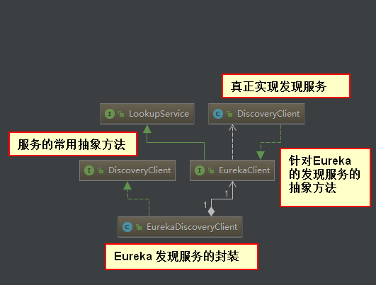

## eureka 客户端源码分析

### EnableDiscoveryClient 注解
搜索DiscoveryClient,我们可以发现有一个类和一个接口

org.springframework.cloud.client.discovery.`DiscoveryClient` 是Spring Cloud的接口
它定义了用来发现服务的常用抽象方法

org.springframework.cloud.netflix.eureka.`EurekaDiscoveryClient` 是对 `DiscoveryClient`
接口的实现，它实现的是对Eureka 发现服务的封装，并依赖com.netflix.discovery.`EurekaClient` 接口，
而真正实现发现服务的则是 `com.netflix.discovery.DiscoveryClient` 类,
而获取 serviceUrl的地址是`com.netflix.discovery.DiscoveryClient` 类中的方法`getEurekaServiceUrlsFromConfig`



### eureka 加载 serviceUrl 加可以从配置中也可以从cdn中（cdn可以动态添加eureka服务端）

- 加载serviceUrl配置的入口 
```
com.netflix.discovery.shared.resolver.aws.ConfigClusterResolver 类
中的 getClusterEndpoints 方法

   @Override
    public List<AwsEndpoint> getClusterEndpoints() {
        if (clientConfig.shouldUseDnsForFetchingServiceUrls()) {
            logger.info("Resolving eureka endpoints via DNS");
            return getClusterEndpointsFromDns();
        } else {
            logger.info("Resolving eureka endpoints via configuration");
            return getClusterEndpointsFromConfig();
        }
    }
```

- eureka集群基于DNS配置方式 
  
  http://www.cnblogs.com/relinson/p/eureka_ha_use_dns.html 

### 看哪里对 Eureka Server的 url 列表进行配置
com.netflix.discovery.endpoint.EndpointUtils.getServiceUrlsFromConfig
```
public static Map<String, List<String>> getServiceUrlsMapFromConfig(EurekaClientConfig clientConfig, String instanceZone, boolean preferSameZone) {
        Map<String, List<String>> orderedUrls = new LinkedHashMap<>();
        
        //从配置中读取一个ribbon 返回，一个微服务应用只可以属于一个 Region,默认为：default
        String region = getRegion(clientConfig);
        
        //当没有为region配置 zone 的时候，将默认采用 defaultZone,这也是eureka.client.serviceUrl.defaultZone的由来
        String[] availZones = clientConfig.getAvailabilityZones(clientConfig.getRegion());
       
        if (availZones == null || availZones.length == 0) {
            availZones = new String[1];
            availZones[0] = DEFAULT_ZONE;
        }
        logger.debug("The availability zone for the given region {} are {}", region, Arrays.toString(availZones));
       
        //根据传入的参数按一定的算法确定加载位于哪一个Zone配置的 serviceUrls
        int myZoneOffset = getZoneOffset(instanceZone, preferSameZone, availZones);

        String zone = availZones[myZoneOffset];
        List<String> serviceUrls = clientConfig.getEurekaServerServiceUrls(zone);
        if (serviceUrls != null) {
            orderedUrls.put(zone, serviceUrls);
        }
        int currentOffset = myZoneOffset == (availZones.length - 1) ? 0 : (myZoneOffset + 1);
        while (currentOffset != myZoneOffset) {
            zone = availZones[currentOffset];
            serviceUrls = clientConfig.getEurekaServerServiceUrls(zone);
            if (serviceUrls != null) {
                orderedUrls.put(zone, serviceUrls);
            }
            if (currentOffset == (availZones.length - 1)) {
                currentOffset = 0;
            } else {
                currentOffset++;
            }
        }

        if (orderedUrls.size() < 1) {
            throw new IllegalArgumentException("DiscoveryClient: invalid serviceUrl specified!");
        }
        return orderedUrls;
    }
    
    
```

###  Regin 和 zone 一对多的关系
regin 默认值 default 

zone 默认值 defaultZone

### 只有在获取Region 和zone 的信息之后，才开始真正的加载Eureka server的具体地址，
它根据传入的参数按一定的算法确定加载位于哪一个zone配置的serviceUrls

int myZoneOffset = getZoneOffset(instanceZone, preferSameZone, availZones);

在 Eureka 中有分 Region（区域）和 Zone（Availability Zone，可用区）;
Amazon EC2（Amazon Elastic Compute Cloud，亚马逊弹性计算云）托管在全球的多个地方，
这些地方由 Region 和 Zone 来组成。每个 Region 都是完全独立的（你可以简单的理解成是 Eureka 集群），
每个 Region 里面有多个隔离的区域称为 Zone（你可以简单的理解成是机房）。
Region 中的每个 Zone 都是隔离的，但是它们可以通过低延迟的链接来进行联系。

### 具体获取serviceUrls的实现
EurekaClientConfigBean：用来加载eureka的配置内容
org.springframework.cloud.netflix.eureka.`EurekaClientConfigBean`.getEurekaServerServiceUrls方法
```
	@Override
	public List<String> getEurekaServerServiceUrls(String myZone) {
		String serviceUrls = this.serviceUrl.get(myZone);
		if (serviceUrls == null || serviceUrls.isEmpty()) {
			serviceUrls = this.serviceUrl.get(DEFAULT_ZONE);
		}
		if (!StringUtils.isEmpty(serviceUrls)) {
		
		    //如何解析eureka.client.serviceUrl.defaultZone 的过程,通过逗号分隔，可以配置多个
			final String[] serviceUrlsSplit = 
			StringUtils.commaDelimitedListToStringArray(serviceUrls);
		
			
			List<String> eurekaServiceUrls = new ArrayList<>(serviceUrlsSplit.length);
			for (String eurekaServiceUrl : serviceUrlsSplit) {
				if (!endsWithSlash(eurekaServiceUrl)) {
					eurekaServiceUrl += "/";
				}
				eurekaServiceUrls.add(eurekaServiceUrl);
			}
			return eurekaServiceUrls;
		}

		return new ArrayList<>();
	}
```

### serviceUrl总结
当我们在微服务应用中使用Ribbon 来实现服务调用时，对于zone 的设置可以在负载均衡时实现区域亲和特性;
ribbon 的默认策略会优先访问同客户端处于一个 zone 中的服务端实例，只有当同一个zone中没有可用服务端实例
的时候，才会访问其他zone中的实例。所以通过zone属性的定义，配合实际部署的物理结构，就可以有效设计出对区域
性故障的容错集群


###  regin 和 zone 的配置 例子
```
eureka.client.region=zhang
eureka.client.availability-zones.zhang=a,b,c,d
eureka.client.service-url.a=http://127.0.0.1:1111/eureka/
eureka.client.service-url.b=http://127.0.0.1:1113/eureka/,http://127.0.0.1:1114/eureka/
eureka.client.service-url.c=http://127.0.0.1:1115/eureka/,http://127.0.0.1:1116/eureka/
eureka.client.service-url.d=http://127.0.0.1:1111/eureka/
```

### Zone

Eureka支持Region和Zone的概念。其中一个Region可以包含多个Zone。Eureka在启动时需要指定一个Zone名，
即当前Eureka属于哪个zone, 如果不指定则属于defaultZone。Eureka Client也需要指定Zone, 
Client(当与Ribbon配置使用时)在向Server获取注册列表时会优先向自己Zone的Eureka发请求，
如果自己Zone中的Eureka全挂了才会尝试向其它Zone。当获取到远程服务列表后，
Client也会优先向同一个Zone的服务发起远程调用。Region和Zone可以对应于现实中的大区和机房，
如在华北地区有10个机房，在华南地区有20个机房，那么分别为Eureka指定合理的Region和Zone能
有效避免跨机房调用，同时一个地区的Eureka坏掉不会导致整个该地区的服务都不可用。

### Ribbon软负载均衡

Ribbon工作在服务的调用方，分成两步，第一步先选择 Eureka Server, 它优先选择在同一个Zone且负载较少的
server, 第二步从Eureka中获取到目标服务全部可用的地址，再根据用户指定的策略，从列表中选择一个地址作为
最终要发请求的目标服务器。其中Ribbon提供策略有：轮询、根据响应时间加权等。


### 如何实现 服务注册 
#### 服务获取
查看 com.netflix.discovery.DiscoveryClient 的 initScheduledTasks 方法
```
private void initScheduledTasks() {

        //服务获取定时任务 逻辑
        // 为了定期更新客户端的服务清单，以保证客户端能够访问确实健康的服务实例
        if (clientConfig.shouldFetchRegistry()) {
            // registry cache refresh timer
            // 更新客户端服务列表的时间，默认 30秒
            int registryFetchIntervalSeconds = clientConfig.getRegistryFetchIntervalSeconds();
            int expBackOffBound = clientConfig.getCacheRefreshExecutorExponentialBackOffBound();
            scheduler.schedule(
                    new TimedSupervisorTask(
                            "cacheRefresh",
                            scheduler,
                            cacheRefreshExecutor,
                            registryFetchIntervalSeconds,
                            TimeUnit.SECONDS,
                            expBackOffBound,
                            new CacheRefreshThread() //定期更新客户端的服务清单逻辑
                    ),
                    registryFetchIntervalSeconds, TimeUnit.SECONDS);
        }

        // 服务续约与服务注册在同一个if逻辑中
        if (clientConfig.shouldRegisterWithEureka()) {        
            // 服务续约
            int renewalIntervalInSecs = instanceInfo.getLeaseInfo().getRenewalIntervalInSecs();
            int expBackOffBound = clientConfig.getHeartbeatExecutorExponentialBackOffBound();
            logger.info("Starting heartbeat executor: " + "renew interval is: " + renewalIntervalInSecs);

            // 发送心跳任务，防止被剔除
            // Heartbeat timer
            scheduler.schedule(
                    new TimedSupervisorTask(
                            "heartbeat",
                            scheduler,
                            heartbeatExecutor,
                            renewalIntervalInSecs,
                            TimeUnit.SECONDS,
                            expBackOffBound,
                            new HeartbeatThread() //心跳逻辑在 HeartbeatThread 类中
                    ),
                    renewalIntervalInSecs, TimeUnit.SECONDS);

            // instanceInfoReplicator 是一个定义任务
            //服务注册在 InstanceInfoReplicator 类的 run 方法中执行
            // 查看 InstanceInfoReplicator 的 run 方法
            // InstanceInfo replicator
            instanceInfoReplicator = new InstanceInfoReplicator(
                    this,
                    instanceInfo,
                    clientConfig.getInstanceInfoReplicationIntervalSeconds(),
                    2); // burstSize

            statusChangeListener = new ApplicationInfoManager.StatusChangeListener() {
                @Override
                public String getId() {
                    return "statusChangeListener";
                }

                @Override
                public void notify(StatusChangeEvent statusChangeEvent) {
                    if (InstanceStatus.DOWN == statusChangeEvent.getStatus() ||
                            InstanceStatus.DOWN == statusChangeEvent.getPreviousStatus()) {
                        // log at warn level if DOWN was involved
                        logger.warn("Saw local status change event {}", statusChangeEvent);
                    } else {
                        logger.info("Saw local status change event {}", statusChangeEvent);
                    }
                    instanceInfoReplicator.onDemandUpdate();
                }
            };

            if (clientConfig.shouldOnDemandUpdateStatusChange()) {
                applicationInfoManager.registerStatusChangeListener(statusChangeListener);
            }

            instanceInfoReplicator.start(clientConfig.getInitialInstanceInfoReplicationIntervalSeconds());
        } else {
            logger.info("Not registering with Eureka server per configuration");
        }
    }

```

#### 服务注册
注册操作也是通过REST请求的方式进行的，
发起注册请求的时候，传入了一个 `InstanceInfo` 对象，
该对象就是注册时客户端给服务端的服务的元数据。
```
InstanceInfoReplicator 类的 run 方法

public void run() {
        try {
            discoveryClient.refreshInstanceInfo();

            Long dirtyTimestamp = instanceInfo.isDirtyWithTime();
            if (dirtyTimestamp != null) {
                // 执行服务注册逻辑
                discoveryClient.register();
                instanceInfo.unsetIsDirty(dirtyTimestamp);
            }
        } catch (Throwable t) {
            logger.warn("There was a problem with the instance info replicator", t);
        } finally {
            Future next = scheduler.schedule(this, replicationIntervalSeconds, TimeUnit.SECONDS);
            scheduledPeriodicRef.set(next);
        }
    }
```


### 服务续约
com.netflix.discovery.DiscoveryClient.HeartbeatThread 中的 run 方法
```
  boolean renew() {
        EurekaHttpResponse<InstanceInfo> httpResponse;
        try {
            httpResponse = eurekaTransport.registrationClient.sendHeartBeat(instanceInfo.getAppName(), instanceInfo.getId(), instanceInfo, null);
            logger.debug("{} - Heartbeat status: {}", PREFIX + appPathIdentifier, httpResponse.getStatusCode());
            if (httpResponse.getStatusCode() == 404) {
                REREGISTER_COUNTER.increment();
                logger.info("{} - Re-registering apps/{}", PREFIX + appPathIdentifier, instanceInfo.getAppName());
                return register();
            }
            return httpResponse.getStatusCode() == 200;
        } catch (Throwable e) {
            logger.error("{} - was unable to send heartbeat!", PREFIX + appPathIdentifier, e);
            return false;
        }
    }
```


##参考资料
使用Spring Cloud Netflix技术栈实施微服务架构

http://blog.csdn.net/neosmith/article/details/52204113


##eureka client 分析
http://blog.csdn.net/forezp/article/details/73017664

http://nobodyiam.com/2016/06/25/dive-into-eureka/

Eureka的一些概念

- Register：美 ['rɛdʒɪstɚ] 服务注册 

当Eureka客户端向Eureka Server注册时，它提供自身的元数据，比如IP地址、端口，运行状况指示符URL，主页等。

- Renew：美 [rɪ'nʊ] 服务续约 

Eureka客户会每隔30秒发送一次心跳来续约。 通过续约来告知Eureka Server该Eureka客户仍然存在，没有出现问题。 正常情况下，如果Eureka Server在90秒没有收到Eureka客户的续约，它会将实例从其注册表中删除。 建议不要更改续约间隔。

- Fetch Registries：获取注册列表信息 

Eureka客户端从服务器获取注册表信息，并将其缓存在本地。客户端会使用该信息查找其他服务，从而进行远程调用。该注册列表信息定期（每30秒钟）更新一次。每次返回注册列表信息可能与Eureka客户端的缓存信息不同， Eureka客户端自动处理。如果由于某种原因导致注册列表信息不能及时匹配，Eureka客户端则会重新获取整个注册表信息。 Eureka服务器缓存注册列表信息，整个注册表以及每个应用程序的信息进行了压缩，压缩内容和没有压缩的内容完全相同。Eureka客户端和Eureka 服务器可以使用JSON / XML格式进行通讯。在默认的情况下Eureka客户端使用压缩JSON格式来获取注册列表的信息。

- Cancel：美 ['kænsl] 服务下线 

Eureka客户端在程序关闭时向Eureka服务器发送取消请求。 发送请求后，该客户端实例信息将从服务器的实例注册表中删除。该下线请求不会自动完成，它需要调用以下内容： 
DiscoveryManager.getInstance().shutdownComponent()；

- Eviction: 美 [ɪ'vɪkʃən] 服务剔除 

在默认的情况下，当Eureka客户端连续90秒没有向Eureka服务器发送服务续约，即心跳，Eureka服务器会将该服务实例从服务注册列表删除，即服务剔除。

###Register服务注册

在com.netflix.discovery包下有个DiscoveryClient类，该类包含了Eureka Client向Eureka Server的
相关方法。其中DiscoveryClient实现了EurekaClient接口

在DiscoveryClient类有一个服务注册的方法register()，该方法是通过Http请求向Eureka Client注册
```
    boolean register() throws Throwable {
        logger.info(PREFIX + appPathIdentifier + ": registering service...");
        EurekaHttpResponse<Void> httpResponse;
        try {
        
            //instanceInfo 对象就是注册时客户端给服务端的服务的元数据
            httpResponse = eurekaTransport.registrationClient.register(instanceInfo);
        } catch (Exception e) {
            logger.warn("{} - registration failed {}", PREFIX + appPathIdentifier, e.getMessage(), e);
            throw e;
        }
        if (logger.isInfoEnabled()) {
            logger.info("{} - registration status: {}", PREFIX + appPathIdentifier, httpResponse.getStatusCode());
        }
        return httpResponse.getStatusCode() == 204;
    }
```

initScheduledTasks()方法。该方法主要开启了获取服务注册列表的信息，如果需要向Eureka Server注册，
则开启注册，同时开启了定时向Eureka Server服务续约的定时任务
```
private void initScheduledTasks() {
        //服务获取  eureka.client.fetch-registry=true
        if (clientConfig.shouldFetchRegistry()) {
            
        
            // registry cache refresh timer 
            //eureka.client.registry-fetch-interval-seconds=30
            int registryFetchIntervalSeconds = clientConfig.getRegistryFetchIntervalSeconds();
            
            int expBackOffBound = clientConfig.getCacheRefreshExecutorExponentialBackOffBound();
            scheduler.schedule(
                    new TimedSupervisorTask(
                            "cacheRefresh",
                            scheduler,
                            cacheRefreshExecutor,
                            registryFetchIntervalSeconds,
                            TimeUnit.SECONDS,
                            expBackOffBound,
                            new CacheRefreshThread()
                    ),
                    registryFetchIntervalSeconds, TimeUnit.SECONDS);
        }
            //服务注册相关的判断语句
        if (clientConfig.shouldRegisterWithEureka()) {
            int renewalIntervalInSecs = instanceInfo.getLeaseInfo().getRenewalIntervalInSecs();
            int expBackOffBound = clientConfig.getHeartbeatExecutorExponentialBackOffBound();
            logger.info("Starting heartbeat executor: " + "renew interval is: " + renewalIntervalInSecs);

            // Heartbeat timer
            scheduler.schedule(
                    new TimedSupervisorTask(
                            "heartbeat",
                            scheduler,
                            heartbeatExecutor,
                            renewalIntervalInSecs,
                            TimeUnit.SECONDS,
                            expBackOffBound,
                            new HeartbeatThread()
                    ),
                    renewalIntervalInSecs, TimeUnit.SECONDS);

            //InstanceInfoReplicator它全执行一个定时任务，具体工作为该类的run函数
            // InstanceInfo replicator  
            instanceInfoReplicator = new InstanceInfoReplicator(
                    this,
                    instanceInfo,
                    clientConfig.getInstanceInfoReplicationIntervalSeconds(),
                    2); // burstSize

            statusChangeListener = new ApplicationInfoManager.StatusChangeListener() {
                @Override
                public String getId() {
                    return "statusChangeListener";
                }

                @Override
                public void notify(StatusChangeEvent statusChangeEvent) {
                    if (InstanceStatus.DOWN == statusChangeEvent.getStatus() ||
                            InstanceStatus.DOWN == statusChangeEvent.getPreviousStatus()) {
                        // log at warn level if DOWN was involved
                        logger.warn("Saw local status change event {}", statusChangeEvent);
                    } else {
                        logger.info("Saw local status change event {}", statusChangeEvent);
                    }
                    instanceInfoReplicator.onDemandUpdate();
                }
            };

            if (clientConfig.shouldOnDemandUpdateStatusChange()) {
                applicationInfoManager.registerStatusChangeListener(statusChangeListener);
            }

            instanceInfoReplicator.start(clientConfig.getInitialInstanceInfoReplicationIntervalSeconds());
        } else {
            logger.info("Not registering with Eureka server per configuration");
        }
    }
    
    
    
```

#### eureka server

在Maven的eureka-core:1.6.2的jar包下。打开com.netflix.eureka包EurekaBootStrap的类
com.netflix.eureka.EurekaBootStrap.initEurekaServerContext
其中PeerAwareInstanceRegistryImpl和PeerEurekaNodes两个类看其命名，应该和服务注册以及Eureka Server高可用有关

PeerAwareInstanceRegistryImpl类，在该类有个register()方法，该方法提供了注册，并且将注册后信息同步到其他的Eureka Server服务。
```
public void register(final InstanceInfo info, final boolean isReplication) {
        int leaseDuration = Lease.DEFAULT_DURATION_IN_SECS;
        if (info.getLeaseInfo() != null && info.getLeaseInfo().getDurationInSecs() > 0) {
            leaseDuration = info.getLeaseInfo().getDurationInSecs();
        }
        super.register(info, leaseDuration, isReplication);
        replicateToPeers(Action.Register, info.getAppName(), info.getId(), info, null, isReplication);
    }
```
replicateToPeers()方法，即同步到其他Eureka Server的其他Peers节点，追踪代码，
发现它会遍历循环向所有的Peers节点注册，最终执行类PeerEurekaNodes的register()方法，
该方法通过执行一个任务向其他节点同步该注册信息

可以发现PeerAwareInstanceRegistryImpl的register()方法实现了服务的注册，并且向其他Eureka Server的Peer节点同步了该注册信息，那么register()方法被谁调用了呢？
之前在Eureka Client的分析可以知道，Eureka Client是通过 http来向Eureka Server注册的，
那么Eureka Server肯定会提供一个注册的接口给Eureka Client调用，那么PeerAwareInstanceRegistryImpl的
register()方法肯定最终会被暴露的Http接口所调用;

发现：com.netflix.eureka.resources.ApplicationResource类的addInstance ()方法，即服务注册的接口
```
@POST
    @Consumes({"application/json", "application/xml"})
    public Response addInstance(InstanceInfo info,
                                @HeaderParam(PeerEurekaNode.HEADER_REPLICATION) String isReplication) {
        logger.debug("Registering instance {} (replication={})", info.getId(), isReplication);
        // validate that the instanceinfo contains all the necessary required fields
        if (isBlank(info.getId())) {
            return Response.status(400).entity("Missing instanceId").build();
        } else if (isBlank(info.getHostName())) {
            return Response.status(400).entity("Missing hostname").build();
        } else if (isBlank(info.getAppName())) {
            return Response.status(400).entity("Missing appName").build();
        } else if (!appName.equals(info.getAppName())) {
            return Response.status(400).entity("Mismatched appName, expecting " + appName + " but was " + info.getAppName()).build();
        } else if (info.getDataCenterInfo() == null) {
            return Response.status(400).entity("Missing dataCenterInfo").build();
        } else if (info.getDataCenterInfo().getName() == null) {
            return Response.status(400).entity("Missing dataCenterInfo Name").build();
        }

        // handle cases where clients may be registering with bad DataCenterInfo with missing data
        DataCenterInfo dataCenterInfo = info.getDataCenterInfo();
        if (dataCenterInfo instanceof UniqueIdentifier) {
            String dataCenterInfoId = ((UniqueIdentifier) dataCenterInfo).getId();
            if (isBlank(dataCenterInfoId)) {
                boolean experimental = "true".equalsIgnoreCase(serverConfig.getExperimental("registration.validation.dataCenterInfoId"));
                if (experimental) {
                    String entity = "DataCenterInfo of type " + dataCenterInfo.getClass() + " must contain a valid id";
                    return Response.status(400).entity(entity).build();
                } else if (dataCenterInfo instanceof AmazonInfo) {
                    AmazonInfo amazonInfo = (AmazonInfo) dataCenterInfo;
                    String effectiveId = amazonInfo.get(AmazonInfo.MetaDataKey.instanceId);
                    if (effectiveId == null) {
                        amazonInfo.getMetadata().put(AmazonInfo.MetaDataKey.instanceId.getName(), info.getId());
                    }
                } else {
                    logger.warn("Registering DataCenterInfo of type {} without an appropriate id", dataCenterInfo.getClass());
                }
            }
        }

        //调用 org.springframework.cloud.netflix.eureka.server.InstanceRegistry.register
        registry.register(info, "true".equals(isReplication));
        return Response.status(204).build();  // 204 to be backwards compatible
    }
    
    
        //org.springframework.cloud.netflix.eureka.server.InstanceRegistry.register
        //resolveInstanceLeaseDuration(info)  包含服务的 租赁信息 com.netflix.appinfo.LeaseInfo
    	@Override
    	public void register(final InstanceInfo info, final boolean isReplication) {
    		handleRegistration(info, resolveInstanceLeaseDuration(info), isReplication);
    		super.register(info, isReplication);
    	}
    
```

### 注册中心存储结构
com.netflix.eureka.registry.AbstractInstanceRegistry.register :注册实现
注册中心存储了两层map结构
```
private final ConcurrentHashMap<String, Map<String, Lease<InstanceInfo>>> registry
            = new ConcurrentHashMap<String, Map<String, Lease<InstanceInfo>>>();
          
 //第一层的key存储服务名： InstanceInfo 的appName属性          
 Map<String, Lease<InstanceInfo>> gMap = registry.get(registrant.getAppName());
 
 //第二层的key存储：InstanceInfo中的 instanceId属性
   Lease<InstanceInfo> existingLease = gMap.get(registrant.getId());
             
```
           

### Renew服务续约
eureka-client-1.6.2.jar的DiscoveryClient的类下有renew()方法
```
  boolean renew() {
        EurekaHttpResponse<InstanceInfo> httpResponse;
        try {
            httpResponse = eurekaTransport.registrationClient.sendHeartBeat(instanceInfo.getAppName(), instanceInfo.getId(), instanceInfo, null);
            logger.debug("{} - Heartbeat status: {}", PREFIX + appPathIdentifier, httpResponse.getStatusCode());
            if (httpResponse.getStatusCode() == 404) {
                REREGISTER_COUNTER.increment();
                logger.info("{} - Re-registering apps/{}", PREFIX + appPathIdentifier, instanceInfo.getAppName());
                return register();
            }
            return httpResponse.getStatusCode() == 200;
        } catch (Throwable e) {
            logger.error("{} - was unable to send heartbeat!", PREFIX + appPathIdentifier, e);
            return false;
        }
    }
```
服务端的续约接口在eureka-core:1.6.2.jar的 com.netflix.eureka包下的InstanceResource类下，接口方法为renewLease()，它是REST接口

com.netflix.eureka.resources.InstanceResource.renewLease
``` 
 @PUT
    public Response renewLease(
            @HeaderParam(PeerEurekaNode.HEADER_REPLICATION) String isReplication,
            @QueryParam("overriddenstatus") String overriddenStatus,
            @QueryParam("status") String status,
            @QueryParam("lastDirtyTimestamp") String lastDirtyTimestamp) {
        boolean isFromReplicaNode = "true".equals(isReplication);
       
       
        boolean isSuccess = registry.renew(app.getName(), id, isFromReplicaNode);

        // Not found in the registry, immediately ask for a register
        if (!isSuccess) {
            logger.warn("Not Found (Renew): {} - {}", app.getName(), id);
            return Response.status(Status.NOT_FOUND).build();
        }
        // Check if we need to sync based on dirty time stamp, the client
        // instance might have changed some value
        Response response = null;
        if (lastDirtyTimestamp != null && serverConfig.shouldSyncWhenTimestampDiffers()) {
            response = this.validateDirtyTimestamp(Long.valueOf(lastDirtyTimestamp), isFromReplicaNode);
            // Store the overridden status since the validation found out the node that replicates wins
            if (response.getStatus() == Response.Status.NOT_FOUND.getStatusCode()
                    && (overriddenStatus != null)
                    && !(InstanceStatus.UNKNOWN.name().equals(overriddenStatus))
                    && isFromReplicaNode) {
                registry.storeOverriddenStatusIfRequired(app.getAppName(), id, InstanceStatus.valueOf(overriddenStatus));
            }
        } else {
            response = Response.ok().build();
        }
        logger.debug("Found (Renew): {} - {}; reply status={}" + app.getName(), id, response.getStatus());
        return response;
    } 
```
服务续约有2个参数是可以配置，即Eureka Client发送续约心跳的时间参数和
Eureka Server在多长时间内没有收到心跳将实例剔除的时间参数，在默认的情况下这两个参数分别为30秒和90秒
```
eureka client:

# 心跳时间，即服务续约间隔时间（缺省为30s）
eureka.instance.lease-renewal-interval-in-seconds=5

# 发呆时间，即服务续约到期时间（默认90秒）
eureka.instance.lease-expiration-duration-in-seconds=10
```

##Eureka Client注册一个实例为什么这么慢
- Eureka Client一启动（不是启动完成），不是立即向Eureka Server注册，它有一个延迟向服务端注册的时间，通过跟踪源码，
可以发现默认的延迟时间为40秒，源码在eureka-client-1.6.2.jar的DefaultEurekaClientConfig类下，
代码如下
```
com.netflix.discovery.DefaultEurekaClientConfig

   得到初始实例信息复制间隔秒
   @Override
    public int getInitialInstanceInfoReplicationIntervalSeconds() {
        return configInstance.getIntProperty(
                namespace + "appinfo.initial.replicate.time", 40).get();
    }
```

- Eureka Server的响应缓存

Eureka Server维护每30秒更新的响应缓存,
可通过更改配置eureka.server.responseCacheUpdateIntervalMs来修改。 
所以即使实例刚刚注册，它也不会出现在调用/ eureka / apps REST端点的结果中。
```
# Eureka Server维护每30秒更新的响应缓存
eureka.server.responseCacheUpdateIntervalMs=30000
```

- Eureka Server刷新缓存 

Eureka客户端保留注册表信息的缓存。 该缓存每30秒更新一次（如前所述）。
 因 此，客户端决定刷新其本地缓存并发现其他新注册的实例可能需要30秒。
```
#服务列表缓存清单更新时间
eureka.client.registry-fetch-interval-seconds=30
```

- LoadBalancer Refresh 

Ribbon的负载平衡器从本地的Eureka Client获取服务注册列表信息。
Ribbon本身还维护本地缓存，以避免为每个请求调用本地客户端。 
此缓存每30秒刷新一次（可由ribbon.ServerListRefreshInterval配置）。 
所以，可能需要30多秒才能使用新注册的实例。
```
#Ribbon的负载平衡器从本地的Eureka Client获取服务注册列表信息,需要30多秒才能使用新注册的实例
#ribbon.ServerListRefreshInterval=30
```
综上几个因素，一个新注册的实例，特别是启动较快的实例（默认延迟40秒注册），不能马上被Eureka Server发现。
另外，刚注册的Eureka Client也不能立即被其他服务调用，因为调用方因为各种缓存没有及时的获取到新的注册列表

##Eureka 的自我保护模式

当一个新的Eureka Server出现时，它尝试从相邻节点获取所有实例注册表信息。如果从Peer节点获取信息时出现问题，Eureka Serve会尝试其他的Peer节点。如果服务器能够成功获取所有实例，则根据该信息设置应该接收的更新阈值。如果有任何时间，Eureka Serve接收到的续约低于为该值配置的百分比（默认为15分钟内低于85％），则服务器开启自我保护模式，即不再剔除注册列表的信息。

这样做的好处就是，如果是Eureka Server自身的网络问题，导致Eureka Client的续约不上，Eureka Client的注册列表信息不再被删除，也就是Eureka Client还可以被其他服务消费。


### 什么是自我保护模式？
默认配置下，如果Eureka Server每分钟收到心跳续约的数量低于一个阈值（instance的数量*(60/每个instance的心跳间隔秒数)*自我保护系数），
就会触发自我保护。在自我保护模式中，Eureka Server会保护服务注册表中的信息，不再注销任何服务实例。当它收到的心跳数重新恢复到阈值以上时，
该Eureka Server节点就会自动退出自我保护模式。它的设计哲学前面提到过，那就是宁可保留错误的服务注册信息，也不盲目注销任何可能健康的服务实例。
该模式可以通过eureka.server.enable-self-preservation = false来禁用，
同时eureka.instance.lease-renewal-interval-in-seconds可以用来更改心跳间隔，
eureka.server.renewal-percent-threshold可以用来修改自我保护系数（默认0.85）。

##参考资料

http://cloud.spring.io/spring-cloud-static/Dalston.RELEASE/#netflix-eureka-client-starter

https://github.com/Netflix/eureka/wiki

https://github.com/Netflix/eureka/wiki/Understanding-Eureka-Peer-to-Peer-Communication

http://xujin.org/sc/sc-eureka-register/

http://blog.abhijitsarkar.org/technical/netflix-eureka/

http://nobodyiam.com/2016/06/25/dive-into-eureka/