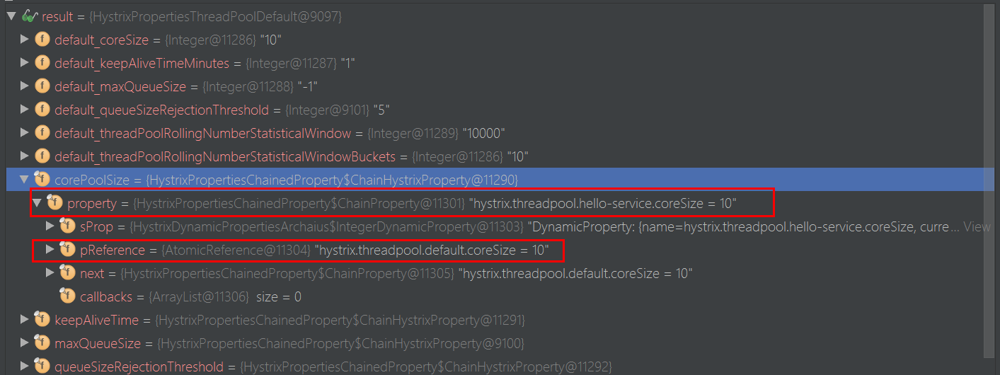
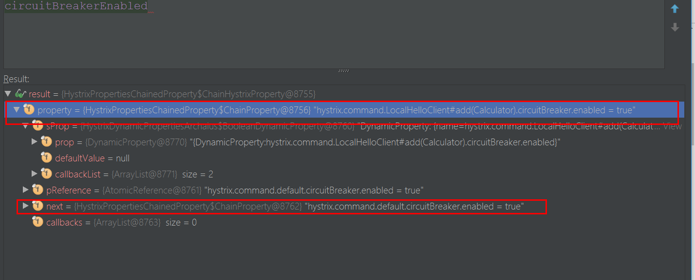

### 默认情况下，SpringCloud Feign会为将所有Feign客户端的方法都封装到Hystrix命令中进行服务保护

### 设置全局的超时时间 hystrix 熔断超时时间
hystrix.command.default.execution.isolation.thread.timeoutInMilliseconds=8000

### hystrix 方法级别 超时配置
hystrix.command.LocalHelloServiceClinet#add(Calculator).execution.isolation.thread.timeoutInMilliseconds=1000


### 全局 关闭 hystrix 
feign.hystrix.enabled=false

### 对某个服务客户端关闭 hystrix 功能
1. 定义配置类 查看 DisableHystrixConfiguration 类
2. 客户端引入配置 @FeignClient(value = "HELLO-SERVICE-1",configuration = DisableHystrixConfiguration.class)


### 关闭熔断功能
hystrix.command.default.execution.timeout.enabled=false


### 线程池 属性 default 是指 服务名


### hystrix command 属性 default 是指 方法名 



### hystrix 线程池 HystrixThreadPool
```
static HystrixThreadPool getInstance(HystrixThreadPoolKey threadPoolKey, 
            HystrixThreadPoolProperties.Setter propertiesBuilder) {
            // get the key to use instead of using the object itself so that 
            //if people forget to implement equals/hashcode things will still work
            String key = threadPoolKey.name();

            // this should find it for all but the first time
            HystrixThreadPool previouslyCached = threadPools.get(key);
            if (previouslyCached != null) {
                return previouslyCached;
            }

            // if we get here this is the first time so we need to initialize
            synchronized (HystrixThreadPool.class) {
                if (!threadPools.containsKey(key)) {
                //HystrixThreadPoolDefault ：HystrixThreadPool的默认实现
                    threadPools.put(key, new HystrixThreadPoolDefault(threadPoolKey, propertiesBuilder));
                }
            }
            return threadPools.get(key);
        }
```
### ThreadPoolExecutor
- corePoolSize	核心线程池大小
- maximumPoolSize	最大线程池大小
- keepAliveTime	线程池中超过corePoolSize数目的空闲线程最大存活时间；可以allowCoreThreadTimeOut(true)使得核心线程有效时间
- TimeUnit	keepAliveTime时间单位
- workQueue	阻塞任务队列
- threadFactory	新建线程工厂
- RejectedExecutionHandler	当提交任务数超过maxmumPoolSize+workQueue之和时，任务会交给RejectedExecutionHandler来处理

### 重点讲解： 
其中比较容易让人误解的是：corePoolSize，maximumPoolSize，workQueue之间关系。 

1. 当线程池小于corePoolSize时，新提交任务将创建一个新线程执行任务，即使此时线程池中存在空闲线程。 
2. 当线程池达到corePoolSize时，新提交任务将被放入workQueue中，等待线程池中任务调度执行 
3. 当workQueue已满，且maximumPoolSize>corePoolSize时，新提交任务会创建新线程执行任务 
4. 当提交任务数超过maximumPoolSize时，新提交任务由RejectedExecutionHandler处理 
5. 当线程池中超过corePoolSize线程，空闲时间达到keepAliveTime时，关闭空闲线程 
6. 当设置allowCoreThreadTimeOut(true)时，线程池中corePoolSize线程空闲时间达到keepAliveTime也将关闭 


### 总结： 
1. 用ThreadPoolExecutor自定义线程池，看线程是的用途，如果任务量不大，可以用无界队列，如果任务量非常大，要用有界队列，防止OOM 
2. 如果任务量很大，还要求每个任务都处理成功，要对提交的任务进行阻塞提交，重写拒绝机制，改为阻塞提交。保证不抛弃一个任务 
3. 最大线程数一般设为2N+1最好，N是CPU核数 
4. 核心线程数，看应用，如果是任务，一天跑一次，设置为0，合适，因为跑完就停掉了，如果是常用线程池，看任务量，是保留一个核心还是几个核心线程数 
5. 如果要获取任务执行结果，用CompletionService，但是注意，获取任务的结果的要重新开一个线程获取，如果在主线程获取，就要等任务都提交后才获取，就会阻塞大量任务结果，队列过大OOM，所以最好异步开个线程获取结果


### hystrix 线程池说明
1. hystrix.threadpool.default.coreSize=10
    - default :指服务名
    - 作用于所有服务
2. hystrix.threadpool.hello-service.coreSize=20 
    - 只对指定的服务配置线程池大小
    - 可以将对队列设置大小，将线程池设为小点


### feign fallback
1. 添加 @Component
2. 实现 feign 的接口
3. fallback = 实现类   