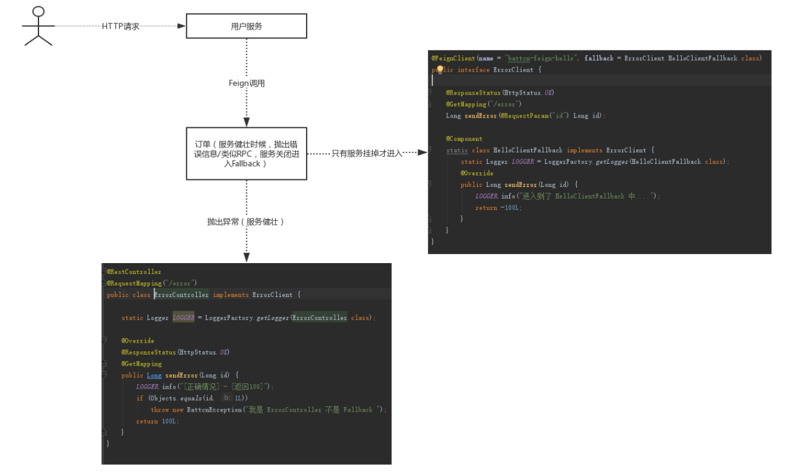

###feign client对restful调用的异常处理
SynchronousMethodHandler类

其中对status code的处理见这段
```
   if (response.status() >= 200 && response.status() < 300) {
        if (void.class == metadata.returnType()) {
          return null;
        } else {
          return decode(response);
        }
      } else if (decode404 && response.status() == 404) {
        return decoder.decode(response, metadata.returnType());
      } else {
        throw errorDecoder.decode(metadata.configKey(), response);
      }
```

也就是feign client的处理跟nginx的是不一样的，feign client把非200的以及404(可以配置是否纳入异常)都算成error，都转给errorDecoder去处理了。

###注意：
要特别注意，对于restful抛出的4xx的错误，也许大部分是业务异常，并不是服务提供方的异常，因此在进行feign client调用的时候，需要进行errorDecoder去处理，适配为HystrixBadRequestException，好避开circuit breaker的统计，否则就容易误判，传几个错误的参数，立马就熔断整个服务了，后果不堪设想。

###errorDecoder实例
```
@Configuration
public class BizExceptionFeignErrorDecoder implements feign.codec.ErrorDecoder{

    private static final Logger logger = LoggerFactory.getLogger(BizExceptionFeignErrorDecoder.class);

    @Override
    public Exception decode(String methodKey, Response response) {
        if(response.status() >= 400 && response.status() <= 499){
            return new HystrixBadRequestException("xxxxxx");
        }
        return feign.FeignException.errorStatus(methodKey, response);
    }
}

```

### 异常图
