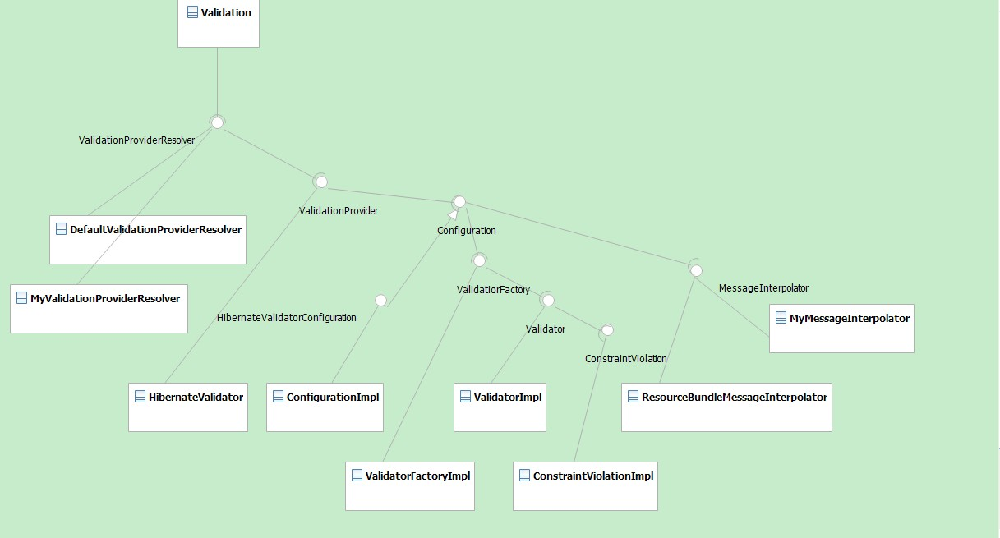

限制	说明
@Null	限制只能为null

@NotNull	限制必须不为null

@AssertFalse	限制必须为false

@AssertTrue	限制必须为true

@DecimalMax(value)	限制必须为一个不大于指定值的数字

@DecimalMin(value)	限制必须为一个不小于指定值的数字

@Digits(integer,fraction)	限制必须为一个小数，且整数部分的位数不能超过integer，小数部分的位数不能超过fraction

@Future	限制必须是一个将来的日期

@Max(value)	限制必须为一个不大于指定值的数字

@Min(value)	限制必须为一个不小于指定值的数字

@Past	限制必须是一个过去的日期

@Pattern(value)	限制必须符合指定的正则表达式

@Size(max,min)	限制字符长度必须在min到max之间

@Past	验证注解的元素值（日期类型）比当前时间早

@NotEmpty	验证注解的元素值不为null且不为空（字符串长度不为0、集合大小不为0）

@NotBlank	验证注解的元素值不为空（不为null、去除首位空格后长度为0），不同于@NotEmpty，@NotBlank只应用于字符串且在比较时会去除字符串的空格

@Email	验证注解的元素值是Email，也可以通过正则表达式和flag指定自定义的email格式

##参考
http://blog.csdn.net/u012373815/article/details/72049796

https://www.ibm.com/developerworks/cn/java/j-lo-beanvalid/

