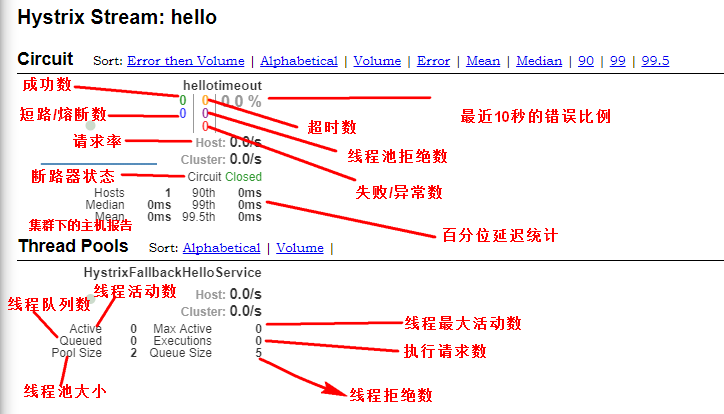

#### Hystrix仪表盘
指标信息会以 滚动时间窗 与桶 结合方式进行汇总，并在内存中驻留一段时间，以供内
部或外部进行查询使用,hystrix 仪表盘就是这些的指标内容的消费者之一

#### hystrix Dashboard 支持的临控方式
- 默认的集群监控
- 指定的集群监控
- 单体应用的监控

Delay : 该参数用来控制服务器上轮询监控信息的延迟时间，默认为2000毫秒，可以通过配置该属性来降低客户端的网络和CPU消耗.
Title : 该参数对应了上图头部标题 Hystrix Stream 之后的内容

#### 监控页面
- 实心圆 ：健康度 绿色、黄色、橙色、红色递减，流量越大该实心圆就越大，所以通过该实心圆的展示，可以在大量
的实例中快速发出故障实例和高压力实例

- 曲线 ：用来记录 2分钟内流量的相对变化，可以通过它来监控流量的上升和下除趋势

>当使用 HystrixBoard 来监控 SpringCloud Zuul 构建的API网关时，ThreadPool信息会
—直处于 Loading 状态。这是由 Zuul 默认会使用信号量来实现隔离，
只有通过 Hystrix 配置把隔离机制改为线程池的方式才能够得以展示。