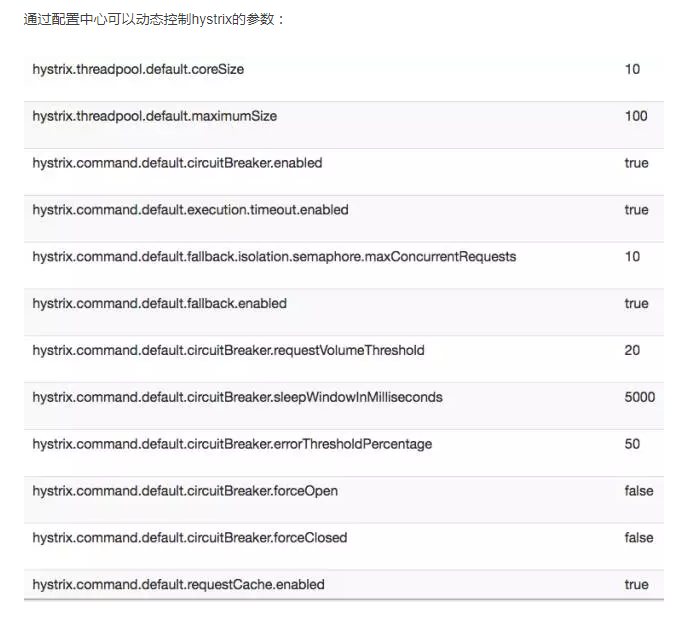

#### 请求命令属性 HystrixCommandProperties

#### 请求合并器 属性 HystrixCollapserProperties

#### 线程池 属性 HystrixThreadPoolProperties

####参考网址
http://tech.lede.com/2017/06/15/rd/server/hystrix/

http://blog.csdn.net/u013851082/article/details/67634570

####下面的属性可以动态的刷新 属性值 

####HystrixCommand 的配置方式
- 通过继承方式
- 通过注解方式

####属性配置的优先级  从低到高
- 全局默认值
- 全局配置属性  配置文件中定义全局属性值
- 实例默认值  通过代码为实例定义的默认值
- 实例配属性 通过配置文件来为指定的实例进行属性配置

####Command Properties  控制 HystrixCommand命令的行为
1. Execution 配置控制 HystrixCommand.run() 的执行
   - execution.isolation.strategy 设置执行的隔离策略 默认值THREAD   THREAD 线程池  SEMAPHORE 信号量
   - execution.isolation.thread.timeoutInMilliseconds 执行的超时时间 默认值 1000 毫秒
   - execution.timeout.enabled 执行是否启用超时时间 默认true ,如果 false ，则execution.isolation.thread.timeoutInMilliseconds
   不起作用
   - execution.isolation.thread.interruptOnTimeout 执行超时的时候是否要将它中断 默认true
   - execution.isolation.thread.interruptOnCancel 执行被取消的时候是否要将它中断 默认false
   - execution.isolation.semaphore.maxConcurrentRequests  当为信号量时，该属性用来配置信号量的大小（并发请求数）默认10
2. Fallback  配置控制 HystrixCommand.getFallback() 的执行
   - fallback.isolation.semaphore.maxConcurrentRequests  HystrixCommand.getFallback()方法执行的最大并发请求数 默认10
   - fallback.enabled 属性用来设置服务降级策略是否启用 默认true
3. Circuit Breaker 配置控制 HystrixCircuitBreaker 的行为
   - circuitBreaker.enabled 用来确定当服务请求命令失败时，是否使用断路器来跟踪其健康指标和熔断请求 默认trure
   - circuitBreaker.requestVolumeThreshold 设置在滚动时间窗中，断路器熔断的最小请求数。默认20
   
   例：默认值为 20 的时候，如果滚动时间窗（默认10秒）内仅收到了 19个请求，即使这19个请求都失败了，断路器也不会打开
   
   - circuitBreaker.sleepWindowInMilliseconds 断路器打开之后的休眠时间窗，休眠时间窗结束之后，会将断路器置为 半开 状态，
   尝试熔断的请求命令，如果依然失败就将断路器继续设置为 打开 状态，如果 成功 就设置为 关闭 状态 默认5000毫秒
   - circuitBreaker.errorThresholdPercentage 设置断路器打开的错误百分比条件
   
   例: 默认值为 5000 毫秒的情况下，表示在滚动时间窗中，在请求数量超过 circuitBreaker.requestVolumeThreshold 阈值的前提下，
   如果错误请求数的百分比超过 50 ，就把断路器设置为 打开 状态，否则就设置为 关闭 状态
   
   - circuitBreaker.forceOpen 默认false,如果设为 true ,断路器将强制进入打开 状态，会拒绝所有请求，该属性优先于 circuitBreaker.forceClosed
   - circuitBreaker.forceClosed 默认false,如果设为 true 断路器将强制进入 关闭 状态
4. Metrics 与HystrixCommand 和 HystrixObservableCommand执行中捕获的指标信息有关
   - metrics.rollingStats.timeInMilliseconds 设置滚动时间窗的长度，单位毫秒，该时间用于断路器判断健康度时需要收集信息时持续时间
   默认10000 即10秒
   
   例：当采用默认值 10000 毫秒时，断路器默认将其拆分成 10个桶（桶的数量通过 metrics.rollingStats.numBuckets 参数设置），每个桶记录
   1000毫秒内的指标信息
   
   - metrics.rollingStats.numBuckets 设置滚动时间窗统计指标信息时划分 桶 的数量  默认10
   
   > metrics.rollingStats.timeInMilliseconds 参数设置必需能够被 metrics.rollingStats.numBuckets 参数整除
   
   - metrics.rollingPercentile.enabled 默认true ,设置对命令执行的延迟是否使用百分位数来跟踪和计算,如果为false ,那么所有的概要
   统计都将返回 -1   
   - metrics.rollingPercentile.timeInMilliseconds 设置百分位统计的滚动窗口的持续时间，单位 毫秒 默认 60000 即 60秒
   - metrics.rollingPercentile.numBuckets 设置百分位统计滚动窗口中使用 桶 的数量 默认值 6
   - metrics.rollingPercentile.bucketSize 设置在执行过程中每个桶中保留的最大执行次数，如果在滚动时间窗内发生超过该设定值的执行
   次数，就从最初的位置开始重写。默认 100
   
   例：值设置为100，滚动窗口为10秒，若在10秒内一个 桶 中发生了 500 次执行，那么桶 中只保留最后100次执行的统计
   
   - metrics.healthSnapshot.intervalInMilliseconds 设置采集影响断路器状态的健康快照 请求成功、错误百分比 的间隔等待时间 默认500
5. requestContext  HystrixCommand 使用的 HystrixRequestContext 的设置
   - requestCache.enabled 配置是否开启请求缓存 默认true
   - requestLog.enabled 设置 HystrixCommand 的执行和事件是否打印日志 到 HystrixRequestLog 中 默认true
   
6. Collapser 用来控制命令合并相关的行为
   - maxRequestsInBatch 设置一次请求合并批处理中允许的最大请求数 默认Integer.MAX_VALUE
   - timerDelayInMilliseconds 设置批处理过程中每个命令延迟的时间，单位毫秒 ,默认10
   - requestCache.enabled 设置批处理过程中是否开启请求缓存 默认true
7. ThreadPool 用来控制 Hystrix 命令所属线程池的配置
   - coreSize 设置执行命令线程池的核心线程数，该值也就是命令执行的最大并发量 默认 10
   - maximumSize 设置线程池的最大队列大小，当设置为 -1时，线程池将使用SynchronousQueue 实现的队列，否则将使用LinkedBlockingQueue
   实现的队列，默认 -1
   - queueSizeRejectionThreshold 用来为队列设置拒绝阈值，通过该参数，即使队列没有达到最大值也能拒绝请求。主要是对LinkedBlockingQueue
   队列的补充，因为 LinkedBlockingQueue 不能动态修改它的对象大小，而通过该属性就可以调整拒绝请求的队列大，默认5
  
   >当 maximumSize 为 -1 的时候，该属性不会生效
   
   - keepAliveTimeMinutes 此属性设置保持活动时间（以分钟为单位）。默认1分钟
     
     在1.5.9之前，所有线程池都是固定大小的，因为coreSize = maximumSize。
     1.5.9之后后,将allowMaximumSizeToDivergeFromCoreSize设置为true允许这两个值不一样,
     如果coreSize < maximumSize，则该属性控制线程在被释放之前将使用多长时间。
     
   - allowMaximumSizeToDivergeFromCoreSize 默认值false
   
   - metrics.rollingStats.timeInMilliseconds 设置滚动时间窗的长度，单位毫秒。该滚动时间窗的长度用于线程池的指标度量，它会被分成多
   个 桶 来统计指标 默认 10000 即 10秒
   - metrics.rollingStats.numBuckets 设置滚动时间窗被划分成 桶 的数量 默认10
   
   >metrics.rollingStats.timeInMilliseconds 参数的设置必须能够被 metrics.rollingStats.numBuckets 参数整除，不然抛出异常
   
     
     
     
###ThreadPool 相关参数
参考 http://blog.csdn.net/clementad/article/details/54315805

线程数默认值10适用于大部分情况（有时可以设置得更小），如果需要设置得更大，那有个基本得公式可以follow：

requests per second at peak when healthy × 99th percentile latency in seconds + some breathing room

每秒最大支撑的请求数*(99%平均响应时间 + 一个缓冲值)

比如：每秒能处理1000个请求，99%的请求响应时间是60ms，那么公式是：
1000 *（0.060+0.012）

基本的原则时保持线程池尽可能小，他主要是为了释放压力，防止资源被阻塞。
当一切都是正常的时候，线程池一般仅会有1到2个线程激活来提供服务

###Hystrix相关的常用配置信息：
- 超时时间（默认1000ms，单位：ms）
1. hystrix.command.default.execution.isolation.thread.timeoutInMilliseconds
2. hystrix.command.HystrixCommandKey.execution.isolation.thread.timeoutInMilliseconds

- 线程池核心线程数
1. hystrix.threadpool.default.coreSize（默认为10）

- Queue
1. hystrix.threadpool.default.maxQueueSize（最大排队长度。默认-1，使用SynchronousQueue。其他值则使用 LinkedBlockingQueue。如果要从-1换成其他值则需重启，即该值不能动态调整，若要动态调整，需要使用到下边这个配置）
2. hystrix.threadpool.default.queueSizeRejectionThreshold（排队线程数量阈值，默认为5，达到时拒绝，如果配置了该选项，队列的大小是该队列）
注意：如果maxQueueSize=-1的话，则该选项不起作用

- 断路器
1. hystrix.command.default.circuitBreaker.requestVolumeThreshold（当在配置时间窗口内达到此数量的失败后，进行短路。默认20个）
2. hystrix.command.default.circuitBreaker.sleepWindowInMilliseconds（短路多久以后开始尝试是否恢复，默认5s）
3. hystrix.command.default.circuitBreaker.errorThresholdPercentage（出错百分比阈值，当达到此阈值后，开始短路。默认50%）

- fallback
1. hystrix.command.default.fallback.isolation.semaphore.maxConcurrentRequests（调用线程允许请求HystrixCommand.GetFallback()的最大数量，默认10。超出时将会有异常抛出，注意：该项配置对于THREAD隔离模式也起作用）   

###结论：
1. 先保持timeout的默认值（1000ms），除非需要修改（其实通常会修改）
2. 先保持threadpool的的线程数为10个，除非需要更多
3. 根据实际业务的请求并发数，配置压力测试并发线程数，然后调整上面两个参数，直到满足需求为止。

###开发注意事项
1. 在什么情况下执行fallback(降级)逻辑   
依赖调用结果分:成功，失败（抛出异常），超时，线程拒绝，短路。 请求失败(异常，拒绝，超时，短路)时执行fallback(降级)逻辑。熔断器默认错误率阈值为50%,超过将自动运行。运行后，可以自动运行或手动调用,停止当前依赖一段时间(5秒)

###运维注意事项
1. 配置依赖调用超时时间配置   
超时时间一般设为比99.5%平均时间略高即可.当调用超时时，直接返回或执行fallback逻辑。     