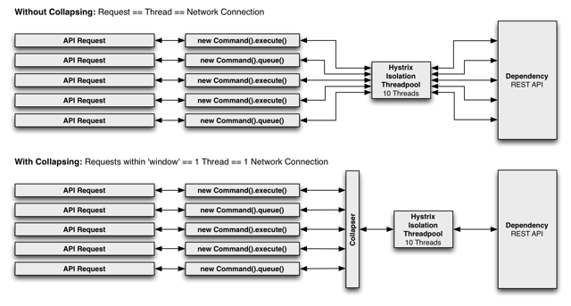

### 命令名称、分组及线程池划分
- 以继承方式实现的hystrix 命令使用类名作为默认的命令名称，可以通过构造函数来设置
```
 public HelloHystrixCommand(RestTemplate restTemplate, String str) {

        super(Setter.withGroupKey(HystrixCommandGroupKey.Factory.asKey("GroupName"))
                .andCommandKey(HystrixCommandKey.Factory.asKey("CommandName")));

        this.restTemplate = restTemplate;
        this.str = str;
    }
```
withGroupKey 设置命令组名，是每个 Setter必需的参数

andCommandKey 设置命令名  是可选参数

通过设置命令组，hystrix 会根据组来组织和统计命令的警告、仪表盘等信息

#### 为什么一定要设置命令组呢？
根据组能实现统计之外,hystrix 命令默认的 线程 划分也是 根据命令组 来实现的，默认情况下，hystrix 会让相同组名的命令使用
同一个线程池，所以在创建 hystrix 命令时为其指定  命令组名 来实现默认的线程池划分 

hystrix 还提拱了 HystrixThreadPoolKey 来对线程池进行设置，实现更细粒度的线程池划分。
通常情况下，尽量通过  HystrixThreadPoolKey 的方式来指定线程池的划分，而不是通过组名的方式
实现划分，因为多个不同的命令可能从业务逻辑上来看属于同一组，但是从实现本身上需要跟其它命令进行隔离

#### 注解方式设置 命令名称、分组、线程池划分
```
 @HystrixCommand(
 commandKey = "getHelloStr", 
 groupKey = "getHelloGroup", 
 threadPoolKey = "getHelloThread", 
 fallbackMethod = "getDefault", 
 ignoreExceptions = BadRequestException.class)
```
commandKey 设置命令名称

groupKey 设置组名称

threadPoolKey 线程池划分


#### 请求缓存
使用请求缓存来优化系统，达到减轻高并发时的请求线程消耗、降低请求响应时间的效果
```
/**
     * 开启 请求缓存功能
     *
     * 当不同的外部请求处理逻辑调用了同一个依赖服务时
     *
     * hystrix 会据据 getCacheKey() 方法返回的值来区分是否是重复的请求，
     *
     * 如果它们的 cacheKey相同，即么该依赖服务只会在第一个请求到达时
     *
     * 被真实地调用一次，另外一个请求则就是直接从请求缓存中返回结果
     * 
     * @return
     */
    @Override
    protected String getCacheKey() {
        return str;
    }
```
- 减少重复的请求数、降低依赖服务的并发度
- 在同一用户请求的上下文中，相同的依赖服务的返回数据始终保持一致
- 在 run() 和 construct() 执行之前生效，有效减少不必要的线程开销

#### 清理失效的缓存功能

HelloGetHystrixCommand  命令实现了请求缓存

HelloPostHystrixCommand 命令实现了更新操作之后，并将hystrix 请求相对应的缓存清理

#### 缓存工作原理
```
AbstractCommand.toObservable()

 final boolean requestCacheEnabled = isRequestCachingEnabled();
                final String cacheKey = getCacheKey();

                 尝试从缓存中获取结果
                /* try from cache first */
                if (requestCacheEnabled) {
                    HystrixCommandResponseFromCache<R> fromCache = 
                    (HystrixCommandResponseFromCache<R>) requestCache.get(cacheKey);
                    if (fromCache != null) {
                        isResponseFromCache = true;
                        return handleRequestCacheHitAndEmitValues(fromCache, _cmd);
                    }
                }

                Observable<R> hystrixObservable =
                        Observable.defer(applyHystrixSemantics)
                                .map(wrapWithAllOnNextHooks);

                Observable<R> afterCache;

                // 加入缓存
                if (requestCacheEnabled && cacheKey != null) {
                    // wrap it for caching
                    HystrixCachedObservable<R> toCache = HystrixCachedObservable.from(hystrixObservable, _cmd);
                    
                    请求缓存对象 HystrixCachedObservable 中维护了一个线程安全的map 来保存请求缓存的响应
                    调用 putIfAbsent 方法 将包装的请求缓存放入缓存对象后，
                    如果 fromCache不为null   说明当前缓存 key 的请求命令缓存命中
                    HystrixCommandResponseFromCache<R> fromCache = 
                    (HystrixCommandResponseFromCache<R>) requestCache.putIfAbsent(cacheKey, toCache);
                    if (fromCache != null) {
                        // another thread beat us so we'll use the cached value instead
                        toCache.unsubscribe();
                        isResponseFromCache = true;
                        return handleRequestCacheHitAndEmitValues(fromCache, _cmd);
                    } else {
                        // 执行取消订阅操作，即不发起真实请求，同时调用缓存命令的处理方法
                        //handleRequestCacheHitAndEmitValues 来执行缓存命中的结果获取
                        //如果fromCache为null 说明缓存没有命中，则将当前结果 toObservable() 缓存起来，
                        //并将其转换成 Observable 返回给调用者使用
                        afterCache = toCache.toObservable();
                    }
                } else {
                    afterCache = hystrixObservable;
                }
                              
```

####缓存相关步骤
- 尝试获取相关请求缓存
- 将请求结果加入缓存


#### 注解实现请求缓存
- JSR 107是java 缓存 API 的定义，也被称为 JCache
- 请求缓存的注解
@CacheResult 用来标记请求命令返回的结果应该被缓存 必需与 @HystrixCommand注解结合使用
@CacheRemove 用来让请求命令的缓存失效
@CacheKey 用来标记缓存的key 值 ，如果没有标记，则会使用所有参数


#### 请求合并   @HystrixCollapser
微服架构中的依赖通常通过远程调用实现，而远程调用中最常见的问题就是通信的消耗与连接数占用。
在高并发下，因通信次数的增加，总的通信时间消耗将会变得不那么理想，同时，因为依赖服务的线程池资源有限
，将出现排队等待与响应延迟的情况。为了优化这两个问题，@HystrixCollapser 来实现请求的合并，以减少通
信消耗和线程数的占用


HystrixCollapser 实现了在 HystrixCommand之前置一个合并处理器，将处于 一个很短的时间窗（默认10毫秒）内对同一依赖
服务的多个请求进行整合并以批量方式发起请求的功能（服务提供方也需要提供相应的批量实现接口）

HystrixCollapser 指定了三个不同的类型
- BatchReturnType 合并后批量请求的返回类型
- ResponseType 单个请求返回的类型
- RequestArgumentType 请求参数类型

HystrixCollapser 抽象方法
- public abstract RequestArgumentType getRequestArgument(); 定义获取请求参数的方法
- protected abstract HystrixCommand<BatchReturnType> createCommand(Collection<CollapsedRequest<ResponseType, RequestArgumentType>> requests);
合并请求产生批量命令的具体实现方法
- protected abstract void mapResponseToRequests(BatchReturnType batchResponse, Collection<CollapsedRequest<ResponseType, RequestArgumentType>> requests);
指量命令结果返回后的处理，将批量结果拆分并传递给合并前的各个原子请求命令的逻辑



```
    /**
     * 请求合并 注解配置
     * @param str
     * @return
     */

    @HystrixCollapser(batchMethod = "getHelloStr", collapserProperties = {
            @HystrixProperty(name = "timerDelayInMilliseconds", value = "100") })
    public String find(String str) {
        return null;
    }
    
    batchMethod :指定批量请求的实现方法
    collapserProperties 合并请求器相关设置
```
