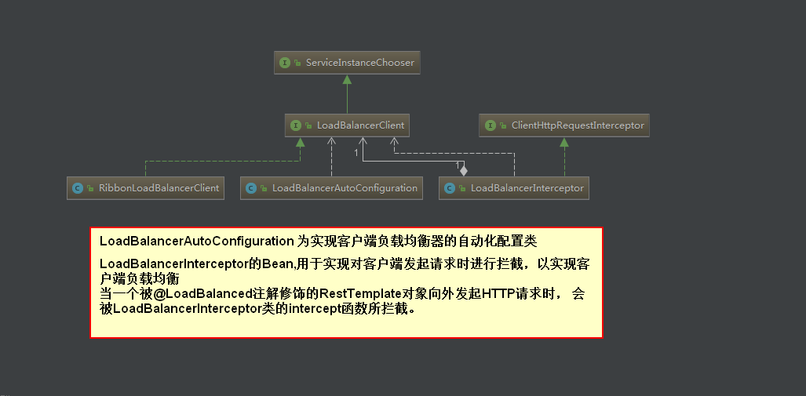
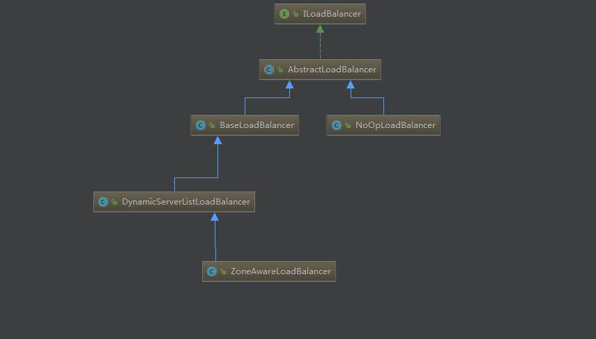

## 源码分析

### Ribbon 是如何通过 RestTemplate 实现负载均衡的

从@LoadBalanced注解源码 的注释中可以知道，该注解用来给RestTemplate做
标记，以使用负载均衡的客户端(LoadBalancerClient)来配置它.
```
public interface LoadBalancerClient extends ServiceInstanceChooser {

        //使用从负载均衡器中挑选出的服务实例来执行请求内容
	<T> T execute(String serviceId, LoadBalancerRequest<T> request) throws IOException;

	<T> T execute(String serviceId, ServiceInstance serviceInstance, LoadBalancerRequest<T> request) throws IOException;

   //系统构建一个合适的host:po江形式的URI
   //ServiceInstance对象是带有host和port的具体服务实例
   //URI内容则是通过ServiceInstance的服务实例详情拼接出的具体host:post形式的请求地址
	URI reconstructURI(ServiceInstance instance, URI original);
}


public interface ServiceInstanceChooser {
   //根据传入的服务名serviceld, 从负载均衡器中挑选一个对应服务的实例。
    ServiceInstance choose(String serviceId);
}
```

#### LoadBalancerClient 接口


#### 代码分析
- LoadBalancerAutoConfiguration 为实现客户端负载均衡器的自动化配置类
- 自动化配置类的作用
    - 创建了一个LoadBalancerInterceptor的Bean,用于实现对客户端发起请求时进行拦截，以实现客户端负载均衡。
    - 创建了一个RestTemplateCustomizer的Bean,用于给 RestTemplate 增加 LoadBalancerInterceptor 拦截器。
    - 维护了一个被`@LoadBalanced`注解修饰的RestTemplate对象列表， 并在这里进行初始化，
      通过调用`RestTemplateCustomizer`的实例来给需要客户端负载均衡的`RestTemplate`
      增加`LoadBalancerInterceptor`拦截器。
```
@Configuration
@ConditionalOnClass(RestTemplate.class)
@ConditionalOnBean(LoadBalancerClient.class)
@EnableConfigurationProperties(LoadBalancerRetryProperties.class)
public class LoadBalancerAutoConfiguration {

	@LoadBalanced
	@Autowired(required = false)
	private List<RestTemplate> restTemplates = Collections.emptyList();

	@Bean
	public SmartInitializingSingleton loadBalancedRestTemplateInitializer(
			final List<RestTemplateCustomizer> customizers) {
		return new SmartInitializingSingleton() {
			@Override
			public void afterSingletonsInstantiated() {
				for (RestTemplate restTemplate : LoadBalancerAutoConfiguration.this.restTemplates) {
					for (RestTemplateCustomizer customizer : customizers) {
						customizer.customize(restTemplate);
					}
				}
			}
		};
	}

	@Autowired(required = false)
	private List<LoadBalancerRequestTransformer> transformers = Collections.emptyList();

	@Bean
	@ConditionalOnMissingBean
	public LoadBalancerRequestFactory loadBalancerRequestFactory(
			LoadBalancerClient loadBalancerClient) {
		return new LoadBalancerRequestFactory(loadBalancerClient, transformers);
	}

	@Configuration
	@ConditionalOnMissingClass("org.springframework.retry.support.RetryTemplate")
	static class LoadBalancerInterceptorConfig {
		
		// 创建了一个LoadBalancerInterceptor的Bean,用于实现对客户端发起请求时进行拦截，以实现客户端负载均衡
		@Bean
		public LoadBalancerInterceptor ribbonInterceptor(
				LoadBalancerClient loadBalancerClient,
				LoadBalancerRequestFactory requestFactory) {
			return new LoadBalancerInterceptor(loadBalancerClient, requestFactory);
		}
 
 
        // 创建了一个RestTemplateCustomizer的Bean,用于给 RestTemplate 增加 LoadBalancerInterceptor 拦截器。
		@Bean
		@ConditionalOnMissingBean
		public RestTemplateCustomizer restTemplateCustomizer(
				final LoadBalancerInterceptor loadBalancerInterceptor) {
			return new RestTemplateCustomizer() {
				@Override
				public void customize(RestTemplate restTemplate) {
					List<ClientHttpRequestInterceptor> list = new ArrayList<>(
							restTemplate.getInterceptors());
					list.add(loadBalancerInterceptor);
					restTemplate.setInterceptors(list);
				}
			};
		}
	}

	@Configuration
	@ConditionalOnClass(RetryTemplate.class)
	static class RetryAutoConfiguration {
		@Bean
		public RetryTemplate retryTemplate() {
			RetryTemplate template =  new RetryTemplate();
			template.setThrowLastExceptionOnExhausted(true);
			return template;
		}

		@Bean
		@ConditionalOnMissingBean
		public LoadBalancedRetryPolicyFactory loadBalancedRetryPolicyFactory() {
			return new LoadBalancedRetryPolicyFactory.NeverRetryFactory();
		}

		@Bean
		public RetryLoadBalancerInterceptor ribbonInterceptor(
				LoadBalancerClient loadBalancerClient, LoadBalancerRetryProperties properties,
				LoadBalancedRetryPolicyFactory lbRetryPolicyFactory,
				LoadBalancerRequestFactory requestFactory) {
			return new RetryLoadBalancerInterceptor(loadBalancerClient, retryTemplate(), properties,
					lbRetryPolicyFactory, requestFactory);
		}

		@Bean
		@ConditionalOnMissingBean
		public RestTemplateCustomizer restTemplateCustomizer(
				final RetryLoadBalancerInterceptor loadBalancerInterceptor) {
			return new RestTemplateCustomizer() {
				@Override
				public void customize(RestTemplate restTemplate) {
					List<ClientHttpRequestInterceptor> list = new ArrayList<>(
							restTemplate.getInterceptors());
					list.add(loadBalancerInterceptor);
					restTemplate.setInterceptors(list);
				}
			};
		}
	}
}
```

#### LoadBalancerinterceptor 拦截器是如何将一个普通的RestTemplate变成客户端负载均衡的
当一个被@LoadBalanced注解修饰的RestTemplate对象向外发起HTTP请求时，
会被LoadBalancerInterceptor类的intercept函数所拦截。

```
public class LoadBalancerInterceptor implements ClientHttpRequestInterceptor {

    //是一个抽象的负载均衡器接口
	private LoadBalancerClient loadBalancer;
	
	private LoadBalancerRequestFactory requestFactory;

	public LoadBalancerInterceptor(LoadBalancerClient loadBalancer, LoadBalancerRequestFactory requestFactory) {
		this.loadBalancer = loadBalancer;
		this.requestFactory = requestFactory;
	}

	public LoadBalancerInterceptor(LoadBalancerClient loadBalancer) {
		// for backwards compatibility
		this(loadBalancer, new LoadBalancerRequestFactory(loadBalancer));
	}

	@Override
	public ClientHttpResponse intercept(final HttpRequest request, final byte[] body,
			final ClientHttpRequestExecution execution) throws IOException {
		final URI originalUri = request.getURI();
		
		// 使用 RestTemplate时采用了服务名作为host
		// 获取服务名
		String serviceName = originalUri.getHost();
		//调用execute函数去根据服务名来选择实例并发起实际的请求
		return this.loadBalancer.execute(serviceName, requestFactory.createRequest(request, body, execution));
	}
}
```

LoadBalancerClient 的实现类是 RibbonLoadBalancerClient 类
- 第一步做的就是通过`getServer`根据传入的服务名`serviceId`去获得具体的服务实例
```
	@Override
	public <T> T execute(String serviceId, LoadBalancerRequest<T> request) throws IOException {
		// 根据 服务id 获取负载均衡器
		ILoadBalancer loadBalancer = getLoadBalancer(serviceId);
		//根据 负载均衡器 获取 服务实例,因为要根据不同的策略，挑选具体的实例,比如 nginx 负载均衡转发到 某个服务上
		Server server = getServer(loadBalancer);
		if (server == null) {
			throw new IllegalStateException("No instances available for " + serviceId);
		}
		
		// 将 Server 对象内容 包装成 RibbonServer 对象 增加了服务名serviceId、是否需要使用HTTPS等其他信息		
		// RibbonServer 是 ServiceInstance 的实现类，所以以存储了 元数据信息
		RibbonServer ribbonServer = new RibbonServer(serviceId, server, isSecure(server,
				serviceId), serverIntrospector(serviceId).getMetadata(server));

		return execute(serviceId, ribbonServer, request);
	}
	
	@Override
    public <T> T execute(String serviceId, ServiceInstance serviceInstance, LoadBalancerRequest<T> request) throws IOException {
    		Server server = null;
    		if(serviceInstance instanceof RibbonServer) {
    			server = ((RibbonServer)serviceInstance).getServer();
    		}
    		if (server == null) {
    			throw new IllegalStateException("No instances available for " + serviceId);
    		}
    
    		RibbonLoadBalancerContext context = this.clientFactory
    				.getLoadBalancerContext(serviceId);
    		
    		RibbonStatsRecorder statsRecorder = new RibbonStatsRecorder(context, server);
    
    		try {
    		
    		     // 向一个实际的具体服务实例发起请求，从而实现以服务名为host的URI请求到host:post形式
    		     // serviceInstance 接口对象是对服务实例的抽象定义
    			T returnVal = request.apply(serviceInstance); //回调拦截器中的方法 
    			
    			===========================>>
    			request.apply(serviceInstance) 说明：
    			// 这里回调的是 LoadBalancerInterceptor 类中的 intercept 中的 
                // requestFactory.createRequest(request, body, execution)语句
    			<<==========================
    			
    			
    		    // 执行具体的请求之后，Ribbon 还能过 RibbonStatsRecorder 对象
    		    // 对服务的请求进行了跟踪记录
    			statsRecorder.recordStats(returnVal);
    			return returnVal;
    		}
    		// catch IOException and rethrow so RestTemplate behaves correctly
    		catch (IOException ex) {
    			statsRecorder.recordStats(ex);
    			throw ex;
    		}
    		catch (Exception ex) {
    			statsRecorder.recordStats(ex);
    			ReflectionUtils.rethrowRuntimeException(ex);
    		}
    		return null;
    	}
```
- getServer(ILoadBalancer loadBalancer)

获取具体服务实例的时候并没,有使用 `LoadBalancerClient` 接口中的 `choose` 函数,而是使用了Netflix Ribbon自身
的 `ILoadBalancer` 接口中定义的chooseServer函数。
```
	protected Server getServer(ILoadBalancer loadBalancer) {
		if (loadBalancer == null) {
			return null;
		}
		
		//默认 ILoadBalancer 的默认实现类为 ZoneAwareLoadBalancer类
		// chooseServer 函数获取了负载均衡策略分配到的服务实例对象Server
		return loadBalancer.chooseServer("default"); // TODO: better handling of key
	}
```

ILoadBalancer 定义了客户端负载均衡器需要的一系列抽象操作
```
public interface ILoadBalancer {

    // 向负载均衡器中维护的实例列表增加服务实例
	public void addServers(List<Server> newServers);

    // 通过某种策略，从负载均衡器中挑选出一个具体的服务实例
	public Server chooseServer(Object key);

   // 用来通知和标识负载均衡器中某个具体实例已经停止服务
   // 不然负载均衡器在下一次获取服务实例清单前都会认为服务实例均是正常服务的
	public void markServerDown(Server server);
	
	// 获取当前正常服务的实例列表。
	public List<Server> getReachableServers();
	
	// 获取所有已知的服务实例列表，包括正常服务和停止服务的实例
	public List<Server> getAllServers();
}
```
Server 对象定义是一个传统的服务端节点服务端节点的。在该类中存储了
一些元数据信息，包括host、 port、zone、分组以及一些部署信息等。




#### 当 整合Ribbon 的时候Spring Cloud默认采用了哪个负载均衡器具体实现呢？
查看 RibbonClientConfiguration 配置类,默认采用 ZoneAwareLoadBalancer 来实现负载均衡器的

```
	@Bean
	@ConditionalOnMissingBean
	public ILoadBalancer ribbonLoadBalancer(IClientConfig config,
			ServerList<Server> serverList, ServerListFilter<Server> serverListFilter,
			IRule rule, IPing ping) {
		if (this.propertiesFactory.isSet(ILoadBalancer.class, name)) {
			return this.propertiesFactory.get(ILoadBalancer.class, config, name);
		}
		ZoneAwareLoadBalancer<Server> balancer = LoadBalancerBuilder.newBuilder()
				.withClientConfig(config).withRule(rule).withPing(ping)
				.withServerListFilter(serverListFilter).withDynamicServerList(serverList)
				.buildDynamicServerListLoadBalancer();
		return balancer;
	}
```
回到 RibbonLoadBalancerClient的 execute 函数逻辑，在通过 ZoneAwareLoadBalancer
的 chooseServer 函数获取了负载均衡策略分配到的服务实例对象Server之后，将其内容包装成 RibbonServer 对象。
再调用 LoadBalancerRequest 类中的 apply 函数，向一个实际的具体服务实例发起请求，
从而实现以服务名为host的URI请求到host:post形式

#### 对上面 request.apply(serviceInstance) 的说明,apply 函数的回调实现
这里回调的是 LoadBalancerInterceptor 类中的 intercept 中的 
requestFactory.createRequest(request, body, execution)语句

LoadBalancerRequestFactory 类中的 createRequest 函数
```
	public LoadBalancerRequest<ClientHttpResponse> createRequest(final HttpRequest request,
			final byte[] body, final ClientHttpRequestExecution execution) {
		return new LoadBalancerRequest<ClientHttpResponse>() {
             
			@Override
			public ClientHttpResponse apply(final ServiceInstance instance)
					throws Exception {
				HttpRequest serviceRequest = new ServiceRequestWrapper(request, instance, loadBalancer);
				if (transformers != null) {
					for (LoadBalancerRequestTransformer transformer : transformers) {
						serviceRequest = transformer.transformRequest(serviceRequest, instance);
					}
				}
				return execution.execute(serviceRequest, body);
			}

		};
	}
```

#### apply(final ServiceInstance instance) 函数接收到了具体 ServiceInstance 实例后
#### 如何通过 LoadBalancerClient 接口中的 reconstructURI 操作来组织具体请求地址的呢？
apply 具体执行的时候，传入的是 ServiceRequestWrapper 的对象。查看 ServiceRequestWrapper 类
重写了 getURI() 函数，这里调用 LoadBalancerClient 接口的  reconstructURI 函数来构建一个 URI 来进行访问。
```
public class ServiceRequestWrapper extends HttpRequestWrapper {
	private final ServiceInstance instance;
	private final LoadBalancerClient loadBalancer;

	public ServiceRequestWrapper(HttpRequest request, ServiceInstance instance,
								 LoadBalancerClient loadBalancer) {
		super(request);
		this.instance = instance;
		this.loadBalancer = loadBalancer;
	}
	
	@Override
	public URI getURI() {
		URI uri = this.loadBalancer.reconstructURI(
				this.instance, getRequest().getURI());
		return uri;
	}
}

```
在 LoadBalancerInterceptor 拦截器中，ClientHttpRequestExecution 的实例
具体执行 LoadBalancerRequestFactory 类中的 createRequest 方法中的  execution.execute(serviceRequest, body) 时，
会调用 InterceptingClientHttpRequest 类下 InterceptingRequestExecution 类的 execute 函数，
具体实现如下
```
public ClientHttpResponse execute(HttpRequest request, byte[] body) throws IOException {
            if (this.iterator.hasNext()) {
                ClientHttpRequestInterceptor nextInterceptor = (ClientHttpRequestInterceptor)this.iterator.next();
                return nextInterceptor.intercept(request, body, this);
            } else {
            
                // 在创建请求的时候,这里的request.getURI()会调用之前介绍的 ServiceRequestWrapper对象中重写的 getURI()函数
                // 此时，getURI()函数 会使用 LoadBalancerClient 对象中的 reconstructURI 函数来组织具体请求的服务实例地址
                ClientHttpRequest delegate = 
                   InterceptingClientHttpRequest.this.requestFactory.createRequest(request.getURI(), request.getMethod());
                delegate.getHeaders().putAll(request.getHeaders());
                if (body.length > 0) {
                    StreamUtils.copy(body, delegate.getBody());
                }

                return delegate.execute(); // 执行具体的请求
                
              // 由 ClientHttpRequest 接口中的 AbstractClientHttpRequest 类 execute 函数执行请求
                
            }
        }
```

#### LoadBalancerClient 对象中的 reconstructURI 函数来组织具体请求的服务实例地址
```
	@Override
	public URI reconstructURI(ServiceInstance instance, URI original) {
		Assert.notNull(instance, "instance can not be null");
		String serviceId = instance.getServiceId();
		
		// 先通过 serviceId 从 SpringClientFactory 类的 clientFactory 对象中
		// 获取对应 serviceId 的负载均衡器的上下文 RibbonLoadBalancerContext 对象
		RibbonLoadBalancerContext context = this.clientFactory
				.getLoadBalancerContext(serviceId);
		
		// 	然后根据 	ServiceInstance 实例中的信息来构建具体服务实例信息的 Server 对象
		Server server = new Server(instance.getHost(), instance.getPort());
		
		// 获取 serviceId 对应的配置信息
		IClientConfig clientConfig = clientFactory.getClientConfig(serviceId);
		ServerIntrospector serverIntrospector = serverIntrospector(serviceId);
		URI uri = RibbonUtils.updateToHttpsIfNeeded(original, clientConfig,
				serverIntrospector, server);
		
		// 并使用	 RibbonLoadBalancerContext 对象中的 
		// reconstructURIWithServer 函数来构建服务实例的 URI	 
		return context.reconstructURIWithServer(server, uri);
	}
```
#### SpringClientFactory 和 RibbonLoadBalancerContext 类
- SpringClientFactory 类是一个用来创建客户端负载均衡器的工厂类，该工厂
  类会为每一个不同名的 Ribbon客户端 生成不同的 Spring上下文。
- RibbonLoadBalancerContext 类是 LoadBalancerContext 的子类，
  该类用于存储一些被负载均衡器使用的上下文内容和API操作 
  reconstructURIWithServer 就是其中之一
  
#### 最终要访问的服务实例的具体地址 context.reconstructURIWithServer(server, uri)
LoadBalancerContext 类中的 reconstructURIWithServer 函数
```
public class LoadBalancerContext implements IClientConfigAware {
  
  .............
  
  public URI reconstructURIWithServer(Server server, URI original) {
        String host = server.getHost();
        int port = server .getPort();
        if (host.equals(original.getHost()) 
                && port == original.getPort()) {
            return original;
        }
        String scheme = original.getScheme();
        if (scheme == null) {
            scheme = deriveSchemeAndPortFromPartialUri(original).first();
        }

        try {
            StringBuilder sb = new StringBuilder();
            sb.append(scheme).append("://");
            if (!Strings.isNullOrEmpty(original.getRawUserInfo())) {
                sb.append(original.getRawUserInfo()).append("@");
            }
            sb.append(host);
            if (port >= 0) {
                sb.append(":").append(port);
            }
            sb.append(original.getRawPath());
            if (!Strings.isNullOrEmpty(original.getRawQuery())) {
                sb.append("?").append(original.getRawQuery());
            }
            if (!Strings.isNullOrEmpty(original.getRawFragment())) {
                sb.append("#").append(original.getRawFragment());
            }
            URI newURI = new URI(sb.toString());
            return newURI;   // 返回具体要请求的url  比如：http://192.168.10.2/hello        
        } catch (URISyntaxException e) {
            throw new RuntimeException(e);
        }
    }
    ....................
}    
```  

reconstructURI 的第一次保存具体的服务实例的参数使用 spring cloud 定义的 ServiceInstance
而 reconstructURIWithServer 中使用了 netflix 中定义的 Server，所以 RibbonLoadBalancerClient
实现 reconstructURI 做了一次转换,将两者内容进行拼接整合，
形成最终要访问的服务实例的具体地址,见 reconstructURIWithServer 函数

### 总结
了解了它是如何通过 LoadBalancerinterceptor 拦截器对 RestTemplate
的请求进行拦截。并利用 SpringCloud 的负载均衡器 LoadBalancerClient 
将以逻辑服务名为 host 的 URI 转换成具体的服务实例地址的过程。

LoadBalancerClient 实现为 RibbonLoadBalancerClient 类。
用 Ribbon 实现负载均衡器的时候，实际使用的还是 Ribbon 中定义的 ILoadBalancer 接口
的实现。自动化配置类 RibbonClientConfiguration 会采用 ZoneAwareLoadBalancer 的实例来实现客户端负载均衡。
见 ribbonLoadBalancer 函数定义