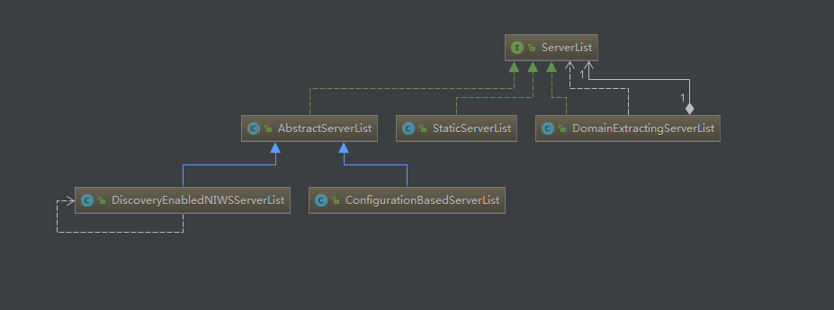
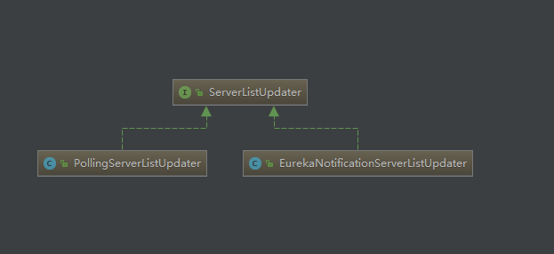
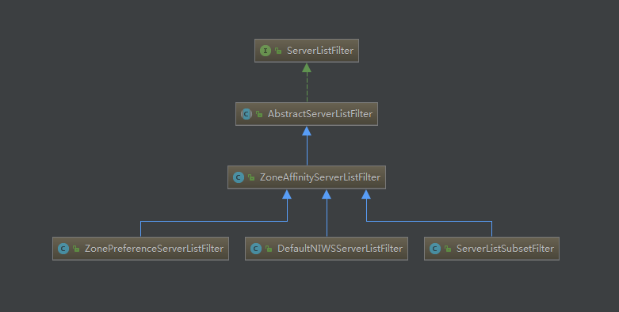

## 负载均衡器
Spring Cloud中定义了 LoadBalancerClient 作为负载均衡器的通用接口。
但是它在具体实现客户端负载均衡时，是通过 Ribbon 的 ILoadBalancer 接口实现的。


#### ILoadBalancer 接口的 负载均衡 实现类

- AbstractLoadBalancer
  
  在该抽象类中定义了一个关于服务实例的分组枚举类 ServerGroup
  - ALL: 所有服务实例。
  - STATUS_UP: 正常服务的实例。
  - STATUS_NOT_UP: 停止服务的实例。

```
public abstract class AbstractLoadBalancer implements ILoadBalancer {
    
    public enum ServerGroup{
        ALL,
        STATUS_UP,
        STATUS_NOT_UP        
    }
    
    // 参数key为null, 表示在选择具体服务实例时忽略key的条件判断
    public Server chooseServer() {
    	return chooseServer(null);
    }
    
    // 定义了根据分组类型来获取不同的服务实例的列表
    public abstract List<Server> getServerList(ServerGroup serverGroup);
    
    // 定义了获取LoadBalancerStats对象的方法, LoadBalancerStats 对象被用来存储负载均衡器中各个服务实例当前的属性和
    // 统计信息.可以利用这些信息来观察负载均衡器的运行情况，同时这些信息也是用来制定负载均衡策略的重要依据. 
    public abstract LoadBalancerStats getLoadBalancerStats();    
}
```  

- BaseLoadBalancer
  BaseLoadBalancer 类是和 Ribbon负载均衡器的基础实现类,定义了很多关于负载均衡器相关的基础内容.
  
  - IPing 对象为 默认为 null,需要在构造时注入它的具体实现
  - 定义了检查服务实例操作的执行策略对象 IPingStrategy，默认使用了该类中定义的静态内部类 SerialPingStrategy 实现
    该策略采用线性遍历 ping 服务实例的方式实现检查，Server列表过大时，可能会影响系统性能，需要通过实现 IPingStrategy 
    接口并重写 pingServers 函数。
    
  - 定义了负载均衡的处理规则 IRule 对象。负载均衡器实际将服务实例选择任务委托给了IRule实例中的choose函数来实现，
    默认初始化了RoundRobinRule 为 IRule的 实现对象，即 线性负载均衡规则。
    
  - 启动ping任务：在 BaseLoadBalancer 的默认构造函数中，会直接启动一个用于定时检查 Server 是否健康的任务。
    该任务默认的执行间隔为10 秒
    
  - markServerDown (Server server):  标记某个服务实例暂停服务   
  
  - getReachableServers(): 获取可用的服务实例列表
  
  - getAllServers(): 获取所有的服务实例列表
  
- DynamicServerListLoadBalancer  

  继承于 BaseLoadBalancer类 它是对基础负载均衡器的扩展。该负载均衡器中，实现了服务实例清单在运行期的动态更新能力。
  同时，它还具备了对服务实例清单的过滤功能
  
  - ServerList 实现类
  
  
  
  - DynamicServerListLoadBalancer 默认配置使用哪个具体实现呢？
    > 在该负载均衡器中需要实现服务实例的动态更新， 那么势必需要 Ribbon 具备访问Eureka来获
      取服务实例的能力，所以查看 ribbon 与 eureka 的包 org.springframework.cloud.netflix.ribbon.eureka
      下查找 EurekaRibbonClientConfiguration 类
      
    发现这个类新增了一个关于服务列表的操作对象： ServerList<T> serverListImpl 
    ```
    	public interface ServerList<T extends Server> {
               
                // 用于获取初始化的服务实例清单
                public List<T> getInitialListOfServers();
               
                // 用于获取更新的服务实例清单
                public List<T> getUpdatedListOfServers();           
            }
    ``` 
      
    查看 EurekaRibbonClientConfiguration 配置类，看到如下代码创建了 ServerList 的实现类
    ```
    	@Bean
    	@ConditionalOnMissingBean
    	public ServerList<?> ribbonServerList(IClientConfig config, Provider<EurekaClient> eurekaClientProvider) {
    		if (this.propertiesFactory.isSet(ServerList.class, serviceId)) {
    			return this.propertiesFactory.get(ServerList.class, config, serviceId);
    		}
    		  
    		// 通过服务发现机制来实现服务实例的获取    		  		
    		DiscoveryEnabledNIWSServerList discoveryServerList = new DiscoveryEnabledNIWSServerList(
    				config, eurekaClientProvider);
    		
    		// 创建了 ServerList 的实例，并通过构造函数传入 DiscoveryEnabledNIWSServerList 对象	
    		DomainExtractingServerList serverList = new DomainExtractingServerList(
    				discoveryServerList, config, this.approximateZoneFromHostname);
    		return serverList;
    	}
    ```  
    
#### DiscoveryEnabledNIWSServerList 类是如何实现服务实例获取的?
主要通过 EurekaClient 从服务注册中心中获取到具体的服务实例 InstanceInfo 列表.
对服务实例进行遍历,将状态 up 的实例转化成 DiscoveryEnabledServer 对象,再以服务列表返回
```
 @Override
    public List<DiscoveryEnabledServer> getInitialListOfServers(){
        return obtainServersViaDiscovery();
    }

    @Override
    public List<DiscoveryEnabledServer> getUpdatedListOfServers(){
        return obtainServersViaDiscovery();
    }


private List<DiscoveryEnabledServer> obtainServersViaDiscovery() {
        List<DiscoveryEnabledServer> serverList = new ArrayList<DiscoveryEnabledServer>();

        if (eurekaClientProvider == null || eurekaClientProvider.get() == null) {
            logger.warn("EurekaClient has not been initialized yet, returning an empty list");
            return new ArrayList<DiscoveryEnabledServer>();
        }
        // 注册中心服务获取服务客户端
        EurekaClient eurekaClient = eurekaClientProvider.get();
        
        if (vipAddresses!=null){ // vipAddress 为逻辑上的服务名 比如 hello-service
            for (String vipAddress : vipAddresses.split(",")) {
                // if targetRegion is null, it will be interpreted as the same region of client
                List<InstanceInfo> listOfInstanceInfo = eurekaClient.getInstancesByVipAddress(vipAddress, isSecure, targetRegion);
                for (InstanceInfo ii : listOfInstanceInfo) {
                    // 对服务实例进行遍历,将状态 up 的实例转化成 DiscoveryEnabledServer 对象
                    if (ii.getStatus().equals(InstanceStatus.UP)) {

                        if(shouldUseOverridePort){
                            if(logger.isDebugEnabled()){
                                logger.debug("Overriding port on client name: " + clientName + " to " + overridePort);
                            }

                            // copy is necessary since the InstanceInfo builder just uses the original reference,
                            // and we don't want to corrupt the global eureka copy of the object which may be
                            // used by other clients in our system
                            InstanceInfo copy = new InstanceInfo(ii);

                            if(isSecure){
                                ii = new InstanceInfo.Builder(copy).setSecurePort(overridePort).build();
                            }else{
                                ii = new InstanceInfo.Builder(copy).setPort(overridePort).build();
                            }
                        }

                        DiscoveryEnabledServer des = new DiscoveryEnabledServer(ii, isSecure, shouldUseIpAddr);
                        // 获取服务实例所在的 zone 
                        des.setZone(DiscoveryClient.getZone(ii));
                        serverList.add(des);
                    }
                }
                if (serverList.size()>0 && prioritizeVipAddressBasedServers){
                    break; // if the current vipAddress has servers, we dont use subsequent vipAddress based servers
                }
            }
        }
        return serverList;
    }
```    

`DomainExtractingServerList 中通过  EurekaClient 从服务注册中心获取到最新的
服务实例清单后`,返回的 list 到了 DomainExtractingServerList 类中,
继续能过 setZones 函数进行处理.将 DiscoveryEnabledServer 转换成内部定义的
DomainExtractingServer 对象,设置必要的属性有:zone、 isAliveFlag、readyToServe等信息
```
private List<DiscoveryEnabledServer> setZones(List<DiscoveryEnabledServer> servers) {
		List<DiscoveryEnabledServer> result = new ArrayList<>();
		boolean isSecure = this.clientConfig.getPropertyAsBoolean(
				CommonClientConfigKey.IsSecure, Boolean.TRUE);
		boolean shouldUseIpAddr = this.clientConfig.getPropertyAsBoolean(
				CommonClientConfigKey.UseIPAddrForServer, Boolean.FALSE);
		for (DiscoveryEnabledServer server : servers) {
			result.add(new DomainExtractingServer(server, isSecure, shouldUseIpAddr,
					this.approximateZoneFromHostname));
		}
		return result;
	}
```

####  总结: 以上就是 ribbon 与 eureka 整合的,如何实现从 eureka server 中获取服务实例清单。
####  那么是如何触发向 EurekaServer 去获取服务实例清单以及如何在获取到服务实例清单后更新本地的服务实例清单的呢？
继续看 DynamicServerListLoadBalancer 中的实现内容 ServerListUpdater。
- ServerListUpdater

```
   // 对ServerList的更新,UpdateAction 对象就是以匿名内部类
   protected final ServerListUpdater.UpdateAction updateAction = new ServerListUpdater.UpdateAction() {
        @Override
        public void doUpdate() {
            // 对 ServerList 的具体更新操作
            updateListOfServers();
        }
    };
    
    
       @VisibleForTesting
       public void updateListOfServers() {
           List<T> servers = new ArrayList<T>();
           if (serverListImpl != null) {
               
               // 调用 DiscoveryEnabledNIWSServerList 类中的 getUpdatedListOfServers() 
               // 从 eureka server 中获取服务可用实例的列表
               servers = serverListImpl.getUpdatedListOfServers();
               
               LOGGER.debug("List of Servers for {} obtained from Discovery client: {}",
                       getIdentifier(), servers);
   
               if (filter != null) {
                   servers = filter.getFilteredListOfServers(servers);
                   LOGGER.debug("Filtered List of Servers for {} obtained from Discovery client: {}",
                           getIdentifier(), servers);
               }
           }
           updateAllServerList(servers);
       } 
```   
ServerListUpdater 的实现类 



- PollingServerListUpdater:  动态服务列表更新的默认策略，
 
  DynamicServerListLoadBalancer 负载均衡器中的默认实现，通过定时任务的方式进行服务列表的更新。

- EurekaNotificationServerListUpdater： 它需要利用 Eureka的事件监听器 来驱动服务列表的更新操作。


#### PollingServerListUpdater 的 start(final UpdateAction updateAction) 函数
通过定义任务，执行更新服务列表，服务启动1秒后，每 30 秒为周期 更新一次 服务列表。
DynamicServerListLoadBalancer.ThreadPoolSize 参数为 更新服务的线程数，默认为 2

```
@Override
    public synchronized void start(final UpdateAction updateAction) {
        if (isActive.compareAndSet(false, true)) {
            final Runnable wrapperRunnable = new Runnable() {
                @Override
                public void run() {
                    if (!isActive.get()) {
                        if (scheduledFuture != null) {
                            scheduledFuture.cancel(true);
                        }
                        return;
                    }
                    try {
                        updateAction.doUpdate();
                        
                        //最后更新的时间
                        lastUpdated = System.currentTimeMillis();
                    } catch (Exception e) {
                        logger.warn("Failed one update cycle", e);
                    }
                }
            };

            scheduledFuture = getRefreshExecutor().scheduleWithFixedDelay(
                    wrapperRunnable,
                    initialDelayMs, // 1000 表示延迟 1秒 
                    refreshIntervalMs, // 30 * 1000 表示 30秒为周期的重复执行
                    TimeUnit.MILLISECONDS
            );
        } else {
            logger.info("Already active, no-op");
        }
    }

```
 
- ServerListFilter

```
public interface ServerListFilter<T extends Server> {
    
    // 实现对服务实例列表的过滤,根据一些规则返回过滤后的服务实例清单
    public List<T> getFilteredListOfServers(List<T> servers);

} 
```
 


ZonePreferenceServerListFilter 是对Netflix Ribbon的扩展实现.

- AbstractServerListFilter:定义了过滤时需要的一个重要依据对象LoadBalancerStats(负载均衡器的一些属性和统计信息)
- ZoneAffinityServerListFilter: 区域感知
  
  它会根据提供服务的实例所处的区域(Zone)与消费者自身的所处区域(Zone) 进行比较过滤掉那些不是同处一个区域的实例
  
服务实例列表的过滤是通过  Iterables.filter(servers, this.zoneAffinityPredicate.getServerOnlyPredicate())来实现的.
判断依据由 zoneAffinityPredicate 实现服务实例 与消费者的Zone比较。
```
   @Override
    public List<T> getFilteredListOfServers(List<T> servers) {
        if (zone != null && (zoneAffinity || zoneExclusive) && servers !=null && servers.size() > 0){
           
           // 服务的实例所处的区域(Zone)与消费者自身的所处区域(Zone) 进行 比较
            List<T> filteredServers = Lists.newArrayList(Iterables.filter(
                    servers, this.zoneAffinityPredicate.getServerOnlyPredicate()));
           
            // 判断是否开启了 区域感知 功能
            if (shouldEnableZoneAffinity(filteredServers)) {
                return filteredServers;
            } else if (zoneAffinity) {
                overrideCounter.increment();
            }
        }
        return servers;
    }
``` 
查看 shouldEnableZoneAffinity 方法 发现LoadBalancerStats 类中的 getZoneSnapshot 函数来获取 
这些过滤后的同区域实例的基础指标 包含实例数量、断路器断开数、活动请求数、实例平均负载等。

```
private boolean shouldEnableZoneAffinity(List<T> filtered) {    
        if (!zoneAffinity && !zoneExclusive) {
            return false;
        }
        if (zoneExclusive) {
            return true;
        }
        LoadBalancerStats stats = getLoadBalancerStats();
        if (stats == null) {
            return zoneAffinity;
        } else {
            logger.debug("Determining if zone affinity should be enabled with given server list: {}", filtered);
            
             // 获取这些过滤后的同区域实例的基础指标
            ZoneSnapshot snapshot = stats.getZoneSnapshot(filtered);
            
            double loadPerServer = snapshot.getLoadPerServer();
            int instanceCount = snapshot.getInstanceCount();            
            int circuitBreakerTrippedCount = snapshot.getCircuitTrippedCount();
            if (((double) circuitBreakerTrippedCount) / instanceCount >= blackOutServerPercentageThreshold.get() 
                    || loadPerServer >= activeReqeustsPerServerThreshold.get()
                    || (instanceCount - circuitBreakerTrippedCount) < availableServersThreshold.get()) {
                
                logger.debug("zoneAffinity is overriden. blackOutServerPercentage: {}, activeReqeustsPerServer: {}, availableServers: {}", 
                        new Object[] {(double) circuitBreakerTrippedCount / instanceCount,  loadPerServer, instanceCount - circuitBreakerTrippedCount});
                return false;
            } else {
                return true;
            }
            
        }
    }
```

若有一个条件符合，就不启用“区域感知”过滤的服务实例清单这一算法实现为集群出现区域故障时，依然可以依靠其他区域的实例进行正常服务提供了完善的
高可用保障.

- blackOutServerPercentage: 故障实例百分比（断路器断开数／实例数量）>=0.8。
- activeReqeustsPerServer: 实例平均负载>=0.6
- availableServers: 可用实例数（实例数量 - 断路器断开数）< 2。


- DefaultNIWSServerListFilter 是默认的NIWS(Netflix Internal Web Service)过滤器.

- ServerListSubsetFilter: 它非常适用于拥有大规模服务器集群（上百或更多）的系统.

  它可以产生一个“区域感知”结果的子集列表，同时它还能够通过比较服务实例的通信失败数量和并发连接数来判定该服务是否健康来选择性地从服务实例列表中剔
  除那些相对不够健康的实例.也就是它限制负载均衡器使用的服务器的数量为所有服务器的子集。
  
  该过滤器的实现主要分为以下三步:
  
  1. 获取 区域感知 的过滤结果，作为候选的服务实例清单.
  2. 从当前消费者维护的服务实例子集中剔除那些相对不够健康的实例.
     
     a. 服务实例的并发连接数超过客户端配置的值，默认为0,
       配置参数为`<clientName>.<nameSpace>.ServerListSubsetFilter.eliminationConnectionThresold` `<nameSpace> 为 ribbon`  
     
     b. 服务实例的失败数超过客户端配置的值，默认为0,
       配置参数为`<clientName>.<nameSpace>.ServerListSubsetFilter.eliminationFailureThresold`
       
     c. 如果按符合上面任一规则的服务实例剔除后，剔除比例小于客户端默认配置的百分比，默认为0.1 也就是 10%
        配置参数为 `<clientName>.<nameSpace>.ServerListSubsetFilter.forceEliminatePercent` 那么就先对剩
        下的实例列表进行健康排序，再从最不健康的实例进行剔除，直到达到配置的剔除百分比.
        
  3. 在完成剔除后，清单已经少了至少10%(默认值)的服务实例,最后通过随机的方式从候选清单中选出一批实例加入到清单中.以保持服务实例子集与原来
     的数量一致，而默认的实例子集数量为20. 其配置参数为 `<clientName>.<nameSpace>.ServerListSubsetFilter.size`     
        


#### ZoneAwareLoadBalancer 就对 DynamicServerListLoadBalancer 的扩展
它依然会采用在 BaseLoadBalancer 中实现的算法。使用 RoundRobinRule 规则以线性轮询的方式来选择调用的服务实例。
该算法实现简单并没有区域(Zone) 的概念，所以它会把所有实例视为一个Zone下的节点来看待。

- setServersList 没有重写，说明实现服务实例清单的更新主逻辑没有修改
- 重写了 setServerListForZones 函数
   
   setServerListForZones 函数在父类 DynamicServerListLoadBalancer 中 setServerListForZones 函数调用位于
   更新服务实例清单函数 setServerListForZones 的最后。 在父类中的作用是根据按区域Zone分组的实例列表。为负载均衡器中的
   LoadBalancerStats 对象创建 Zonestats，并放入 Map zoneStatsMap 集合中，每一个区域Zone对应一个 zoneStats.
   它用于存储每个Zone的一些状态和统计信息.这些逻辑在 在 LoadBalancerStats 类中的 getZoneStats 函数中。
 
ZoneAwareLoadBalancer 负载均衡器扩展了服务实例清单的实现。  
```
   @Override
    protected void setServerListForZones(Map<String, List<Server>> zoneServersMap) {
        super.setServerListForZones(zoneServersMap);
        if (balancers == null) {
        
            // 它将用来存储每个Zone区域对应的负载均衡器
            balancers = new ConcurrentHashMap<String, BaseLoadBalancer>();
        }
        
        // 具体的负载均衡器的创建则是通过在下面的第一个循环中调用 getLoadBalancer 函数来完成，
        // 同时在创建负载均衡器的时候会创建它的规则如果当前实现中没有 IRule 的实例，就创建
        // 一个 AvailabilityFilteringRule 规则,如果已经有具体实例，就克隆一个
     
        for (Map.Entry<String, List<Server>> entry: zoneServersMap.entrySet()) {
        	String zone = entry.getKey().toLowerCase();
            
            // 在创建完负载均衡器后又马上调用 setServersList 函数为其设置对应Zone区域的实例清单
            getLoadBalancer(zone).setServersList(entry.getValue());
        }
        
        // 而第二个循环则是对 Zone 区域中实例清单的检查，看看是否有Zone 区域下已经没有实例了是的话就将
        // balancers 中对应 Zone 区域的实例列表清空,
        // 该操作的作用是为了后续选择节点时,防止过时的Zone区域统计信息干扰具体实例的选择算法.
        for (Map.Entry<String, BaseLoadBalancer> existingLBEntry: balancers.entrySet()) {
            if (!zoneServersMap.keySet().contains(existingLBEntry.getKey())) {
                existingLBEntry.getValue().setServersList(Collections.emptyList());
            }
        }
    }
```  

- ZoneAwareLoadBalancer 如何 挑选服务实例，来实现对区域的识别的

```
    @Override
    public Server chooseServer(Object key) {
        
        if (!ENABLED.get() || getLoadBalancerStats().getAvailableZones().size() <= 1) {
            logger.debug("Zone aware logic disabled or there is only one zone");
            return super.chooseServer(key);
        }
        
        // 只有当负载均衡器中维护的实例所属的 Zone区域 的个数大于 1 的时候才会执行这里的选择策略,否则还是将使用父类的实现.
        Server server = null;
        try {
            LoadBalancerStats lbStats = getLoadBalancerStats();
            
            // 为当前负载均衡器中所有的 Zone 区域分别创建快照，保存在 Map zoneSnapshot 中，这些快照中的数据将用千后续的算法。
            Map<String, ZoneSnapshot> zoneSnapshot = ZoneAvoidanceRule.createSnapshot(lbStats);
            logger.debug("Zone snapshots: {}", zoneSnapshot);
            if (triggeringLoad == null) {
                triggeringLoad = DynamicPropertyFactory.getInstance().getDoubleProperty(
                        "ZoneAwareNIWSDiscoveryLoadBalancer." + this.getName() + ".triggeringLoadPerServerThreshold", 0.2d);
            }

            if (triggeringBlackoutPercentage == null) {
                triggeringBlackoutPercentage = DynamicPropertyFactory.getInstance().getDoubleProperty(
                        "ZoneAwareNIWSDiscoveryLoadBalancer." + this.getName() + ".avoidZoneWithBlackoutPercetage", 0.99999d);
            }
            
            // 获取可用的Zone区域集合 在该 ZoneAvoidanceRule 函数中会通过 Zone 区域快照中的统计数据来实现可用区的挑选
            Set<String> availableZones = ZoneAvoidanceRule.getAvailableZones(zoneSnapshot, triggeringLoad.get(), triggeringBlackoutPercentage.get());
            logger.debug("Available zones: {}", availableZones);
           
            // 当获得的可用 Zone 区域集合不为空，并且个数小于 Zone 区域总数
            if (availableZones != null &&  availableZones.size() < zoneSnapshot.keySet().size()) {
                
                //就随机选择一个Zone区域。
                String zone = ZoneAvoidanceRule.randomChooseZone(zoneSnapshot, availableZones);
                logger.debug("Zone chosen: {}", zone);
                if (zone != null) {
                
                    //在确定了某个 Zone区域 后，则获取了对应Zone区域的服务均衡器
                    BaseLoadBalancer zoneLoadBalancer = getLoadBalancer(zone);
                    
                    // 并调用 chooseServer 来选择具体的服务实例
                    // 在 chooseServer 中将使用 IRule 接口的 choose 函数来选择具体的服务实例
                    // 在这里，IRule 接口的实现会使用 ZoneAvoidanceRule 来挑选出具体的服务实例.
                    server = zoneLoadBalancer.chooseServer(key);
                }
            }
        } catch (Throwable e) {
            logger.error("Unexpected exception when choosing server using zone aware logic", e);
        }
        if (server != null) {
            return server;
        } else {
            logger.debug("Zone avoidance logic is not invoked.");
            return super.chooseServer(key);
        }
    }

```  


  
