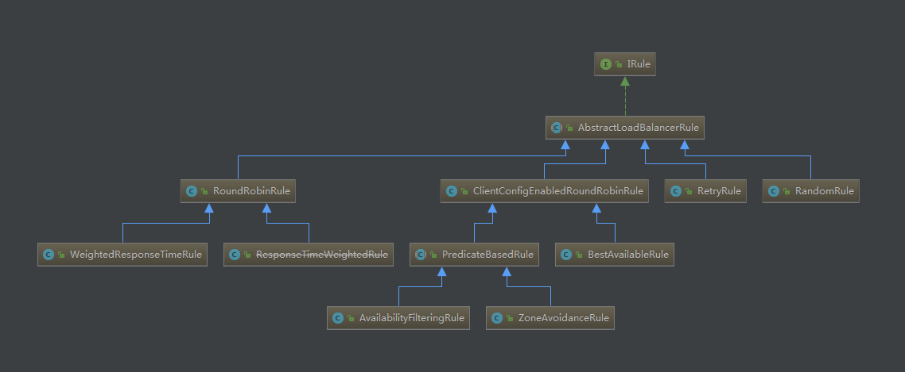

## 已经对Ribbon实现的负载均衡器以及其中包含的服务实例过滤器、服务实例信息的存储对象、区域的信息快照等都已了解
## 下面我们来看看在Ribbon中都提供了哪些负载均衡的策略实现

## IRule 实现类


### AbstractLoadBalancerRule
负载均衡策略的抽象类,在该抽象类中定义了负载均衡器ILoadBalancer对象,该对象能够在具体实现选择服务策略时，获取到
一些负载均衡器中维护的信息来作为分配依据，并以此设计一些符法来实现针对特定场景的高效策略。

```
public abstract class AbstractLoadBalancerRule implements IRule, IClientConfigAware {
    private ILoadBalancer lb;
    
    @Override
    public void setLoadBalancer(ILoadBalancer lb){
        this.lb = lb;
    }
    @Override
    public ILoadBalancer getLoadBalancer(){
        return lb;
    }      
}
```

### RandomRule
该策略实现了从服务实例清单中随机选择一个服务实例的功能。可以看到IRule接口的choose(Object  key)函数实现，委托给了该类中的
choose(ILoadBalancer lb, Object key) 该方法增加了一个负载均衡器对象的参数，它会使用传入的负载均衡器来获得可用实例列表upList
和所有实例列表 allList, 并通过rand.nextInt(serverCount)函数来获取一个随机数，并将该随机数作为 upList 的索引值来返回具体实例。

```
@Override
public Server choose(Object key) {
    return choose(getLoadBalancer(), key);
}

public Server choose(ILoadBalancer lb, Object key) {
    ...
    Server server = null;
    while (server == null) { //如果出现死循环获取不到服务实例时，则很有可能存在并发的Bug
        if (Thread.interrupted()) {
            return null;
        }
        // 使用传入的负载均衡器来获得可用实例列表upList和所有实例列表allList
        List<Server> upList = lb.getReachableServers();
        List<Server> allList = lb.getAllServers();
        int serverCount = allList.size();
        if (serverCount == 0) {
            return null;
        }
        int index = rand.nextInt(serverCount);
        server = upList.get(index);
        if (server == null) {
            Thread.yield();
            continue;
        }
        if (server.isAlive()) {
            return (server);
        }
        server = null;
        Thread.yield();
    }
    return server;
}
```

### RoundRobinRule
该策略实现了按照线性轮询的方式依次选择每个服务实例的功能,与RandomRule非常类似.除了循环条件不同外，就是从可用列表中获取所谓的逻辑不同.
从循环条件中，我们可以看到增加了一个count 计数变量，该变量会在每次循环之后累加，也就是说，如果一直选择不到server超过10 次，那么就会结束尝试.
并打印一个警告 No available alive servers after 10 tries from load balancer。
每次进行实例选择时通过调用 incrementAndGetModulo(int modulo) 函数实现递增。
```
public Server choose(ILoadBalancer lb, Object key) {
    ...
    Server server = null;
    int count = 0;
    while (server == null && count++ < 10) {
        List<Server> reachableServers = lb.getReachableServers();
        List<Server> allServers = lb.getAllServers();
        int upCount = reachableServers.size();
        int serverCount = allServers.size();
        if ((upCount == 0) || (serverCount == 0)) {
            log.warn("No up servers available from load balancer: " + lb);
            return null;
        }
        int nextServerIndex = incrementAndGetModulo(serverCount);
        server = allServers.get(nextServerIndex);
        if (server == null) {
            Thread.yield();
            continue;
        }
        if (server.isAlive() && (server.isReadyToServe())) {
            return (server);
        }
        server = null;
    }
    
    //如果一直选择不到 server 超过10次，那么就会结束尝试，并打印一个警告信息
    if (count >= 10) {
        log.warn("No available alive servers after 10 tries from load balancer: "
                + lb);
    }
    return server;
}
```

### RetryRule
该策略实现了一个具备重试机制的实例选择功能，默认使用了RoundRobinRule实例。而在choose方法中则实现了对内部定义的策略进行反复尝试的策略。
若期间能够选择到具体的服务实例就返回，`若选择不到就根据设置的尝试结束时间为阙值 （maxRetryMillis 参数定义的值 + choose方法开始执行的时间戳）
当超过该阑值后就返回null。`
```
public class RetryRule extends AbstractLoadBalancerRule {
    IRule subRule = new RoundRobinRule();
    long maxRetryMillis = 500;
    ...
    public Server choose(ILoadBalancer lb, Object key) {
        long requestTime = System.currentTimeMillis();
        
        //设置的尝试结束时间为阈值
        long deadline = requestTime + maxRetryMillis;
        Server answer = null;
        answer = subRule.choose(key);
        if (((answer == null) || (!answer.isAlive()))
                && (System.currentTimeMillis() < deadline)) {
            InterruptTask task = new InterruptTask(deadline
                    - System.currentTimeMillis());
            while (!Thread.interrupted()) {
                answer = subRule.choose(key);
                if (((answer == null) || (!answer.isAlive()))
                        && (System.currentTimeMillis() < deadline)) {
                    Thread.yield();
                } else {
                    break;
                }
            }
            task.cancel();
        }
        if ((answer == null) || (!answer.isAlive())) {
            return null;
        } else {
            return answer;
        }
    }
    ...
}
```

### WeightedResponseTimeRule
该策略是对 RoundRobinRule 的扩展.增加了根据实例的运行情况来计算权重,并根据权重来挑选实例，以达到更优的分配效果。

它的实现主要有三个核心内容：
- 定时任务
在 initialize 函数 初始化的时候会通过  serverWeightTimer.schedule(new DynamicServerWeightTask(), 0,serverWeightTaskTimerInterval);
启动一个定时任务，用来为每个服务实例计算权重。该任务默认30秒执行一次。

```
class DynamicServerWeightTask extends TimerTask {
    public void run() {
        ServerWeight serverWeight = new ServerWeight();
        try {
            serverWeight.maintainWeights();
        } catch (Throwable t) {
            logger.error("Throwable caught while running DynamicServerWeightTask for " + name, t);
        }
    }
}
```

- 权重计算
用千存储权重的对象 List<Double> accumulatedWeights = new ArrayList<Double>();
该List 中每个权重值所处的位置对应了负载均衡器维护的服务实例清单中所有实例在清单中的位置。

维护实例权重的计算过程通过 maintainWeights 函数实现，代码如下：

```
public void maintainWeights() {
            ILoadBalancer lb = getLoadBalancer();
            if (lb == null) {
                return;
            }
            if (serverWeightAssignmentInProgress.get()) {
                return; // Ping in progress - nothing to do
            } else {
                serverWeightAssignmentInProgress.set(true);
            }
            try {
                logger.info("Weight adjusting job started");
                AbstractLoadBalancer nlb = (AbstractLoadBalancer) lb;
                LoadBalancerStats stats = nlb.getLoadBalancerStats();
                if (stats == null) {
                    // no statistics, nothing to do
                    return;
                }
                // 计算所有实例的平均响应时间的总和： totalResponseTime 
                double totalResponseTime = 0;
                // find maximal 95% response time
                for (Server server : nlb.getAllServers()) {
         
                   // 如果服务实例的状态快照不在缓存中，那么这里会进行自动加载
                    ServerStats ss = stats.getSingleServerStat(server);
                    totalResponseTime += ss.getResponseTimeAvg();
                }
                // 逐个计算每个实例的权重： weightSoFar + totalResponseTime - 实例的平均响应时间
                Double weightSoFar = 0.0;
                List<Double> finalWeights = new ArrayList<Double>();
                for (Server server : nlb.getAllServers()) {
                    ServerStats ss = stats.getSingleServerStat(server);
                    double weight = totalResponseTime - ss.getResponseTimeAvg();
                    weightSoFar += weight;
                    finalWeights.add(weightSoFar);   
                }
                setWeights(finalWeights);
            } catch (Throwable t) {
                logger.error("Exception while dynamically calculating server weights", t);
            } finally {
                serverWeightAssignmentInProgress.set(false);
            }

        }
```

该函数的实现主要分为两个步骤：
- 根据 LoadBalancerStats 中记录的每个实例的统计信息，累加所有实例的平均响应时间，得到总平均响应时间 totalResponseTime,该值会用于后续的计算。

- 为负载均衡器中维护的实例清单逐个计算权重（从第一个开始），计算规则为 `weightSoFar + totalResponseTime - 实例的平均响应时间`，
其中 weightSoFar 初始化为零，并且每计算好一个权重需要累加到 weightSoFar 上供下一次计算使用.

总结：
实际上每个区间的宽度就是：`总的平均响应时间 - 实例的平均响应时间`，所以实例的平均响应时间越短、权重区间的宽度越大，
而权重区间的宽度越大被选中的概率就越高.

实例选择
WeightedResponseTimeRule选择实例的实现与之前介绍的算法结构类似，下面是它主体的算法（省略了循环体和一些判断等处理）：
```
public Server choose(ILoadBalancer lb, Object key) {
    ...
        List<Double> currentWeights = accumulatedWeights;
        ...
        List<Server> allList = lb.getAllServers();
        int serverCount = allList.size();
        if (serverCount == 0) {
            return null;
        }
        int serverIndex = 0;
        // 获取最后一个实例的权重
        double maxTotalWeight = currentWeights.size() == 0 ? 0 : currentWeights.get(currentWeights.size() - 1);
        if (maxTotalWeight < 0.001d) {
            // 如果最后一个实例的权重值小于0.001，则采用父类实现的线性轮询的策略
            server =  super.choose(getLoadBalancer(), key);
            if(server == null) {
                return server;
            }
        } else {
            // 如果最后一个实例的权重值大于等于0.001，就产生一个[0, maxTotalWeight)的随机数
            double randomWeight = random.nextDouble() * maxTotalWeight;
            int n = 0;
            
            // 遍历维护的权重清单，若权重大于等于随机得到的数值，就选择这个实例
            for (Double d : currentWeights) {    
                if (d >= randomWeight) {
                    serverIndex = n;
                    break;
                } else {
                    n++;
                }
            }
            server = allList.get(serverIndex);
        }
    ...
    return server;
}
```

从源码中，我们可以看到，选择实例的核心过程就两步：

- 生产一个`[0, 最大权重值)区间内的随机数。`

- 遍历权重列表，比较权重值与随机数的大小，如果权重值大于等于随机数，就拿当前权重列表的索引值去服务实例列表中获取具体实例。
  这就是在上一节中提到的服务实例会根据权重区间挑选的原理，而权重区间边界的开闭原则根据算法，正常应该每个区间为(x, y]的形式，
  但是第一个实例和最后一个实例为什么不同呢？由于随机数的最小取值可以为0，所以第一个实例的下限是闭区间，同时随机数的最大值取不到最大权重值，
  所以最后一个实例的上限是开区间。
  
  
### ClientConfigEnabledRoundRobinRule
该策略较为特殊,我们一般不直接使用它。因为它本身并没有实现什么特殊的处理逻辑. 

那么定义它有什么特殊的用处呢？   
通过继承该策略，那么默认的choose就实现了线性轮询机制，在子类中做一些高级策略时通常都有可能会存在一些无法实施的情况，
那么就可以通过父类的实现作为备选.高级策略均是基于 ClientConfigEnabledRoundRobinRule 的扩展。

在它的内部定义了一个RoundRobinRule策略，而choose函数的实现也正是使用了RoundRobinRule的线性轮询机制.

```
public class ClientConfigEnabledRoundRobinRule extends AbstractLoadBalancerRule {

    RoundRobinRule roundRobinRule = new RoundRobinRule();
    ...
    @Override
    public Server choose(Object key) {
        if (roundRobinRule != null) {
            return roundRobinRule.choose(key);
        } else {
            throw new IllegalArgumentException(
                    "This class has not been initialized with the RoundRobinRule class");
        }
    }
}
```

### BestAvailableRule
该策略继承自 ClientConfigEnabledRoundRobinRule，在实现中它注入了负载均衡器的统计对象：LoadBalancerStats，
同时在具体的choose算法中利用LoadBalancerStats保存的实例统计信息来选择满足要求的实例,

从如下源码中我们可以看到，它通过遍历负载均衡器中维护的所有服务实例，会过滤掉故障的实例，
并找出并发请求数最小的一个，`所以该策略的特性是选出最空闲的实例。`
```
public Server choose(Object key) {
    //当loadBalancerStats为空的时候，它会采用父类的线性轮询策略
    if (loadBalancerStats == null) {
        return super.choose(key);
    }
    List<Server> serverList = getLoadBalancer().getAllServers();
    //最小的并发连接
    int minimalConcurrentConnections = Integer.MAX_VALUE;
    long currentTime = System.currentTimeMillis();
    Server chosen = null;
    for (Server server: serverList) {
        ServerStats serverStats = loadBalancerStats.getSingleServerStat(server);
        if (!serverStats.isCircuitBreakerTripped(currentTime)) {
            int concurrentConnections = serverStats.getActiveRequestsCount(currentTime);
            if (concurrentConnections < minimalConcurrentConnections) {
                minimalConcurrentConnections = concurrentConnections;
                chosen = server;
            }
        }
    }
    if (chosen == null) {
        return super.choose(key);
    } else {
        return chosen;
    }
}
```

同时，由于该算法的核心依据是统计对象loadBalancerStats，当其为空的时候，该策略是无法执行的。
所以从源码中我们可以看到，当loadBalancerStats为空的时候，它会采用父类的线性轮询策略，
正如我们在介绍ClientConfigEnabledRoundRobinRule时那样，它的子类在无法满足实现高级策略时候，可以使用线性轮询策略的特性.


### PredicateBasedRule
这是一个抽象策略，它也继承了 ClientConfigEnabledRoundRobinRule，
从其命名中可以猜出他是一个基于 Predicate 实现的策略，`Predicate是Google Guava Collection工具对集合进行过滤的条件接口`。

如下源码所示，它定义了一个`抽象函数getPredicate来获取AbstractServerPredicate对象的实现`，
而在choose函数中，通过AbstractServerPredicate的chooseRoundRobinAfterFiltering函数来选出具体的服务实例。
从该函数的命名我们也大致能猜出它的基础逻辑：`先通过子类中实现的 Predicate 逻辑来过滤一部分服务实例，
然后再以线性轮询的方式从过滤后的实例清单中选出一个。`

```
public abstract class PredicateBasedRule extends ClientConfigEnabledRoundRobinRule {

    public abstract AbstractServerPredicate getPredicate();

    @Override
    public Server choose(Object key) {
        ILoadBalancer lb = getLoadBalancer();
        
        //通过AbstractServerPredicate的chooseRoundRobinAfterFiltering函数来选出具体的服务实例
        Optional<Server> server = getPredicate().chooseRoundRobinAfterFiltering(lb.getAllServers(), key);
        if (server.isPresent()) {
            return server.get();
        } else {
            return null;
        }
    }
}
```
通过下面AbstractServerPredicate的源码片段，可以证实我们上面所做的猜测。
在上面choose函数中调用的 chooseRoundRobinAfterFiltering方法 先通过内部定义的 getEligibleServers函数 来获取备选的实例清单（实现了过滤），
如果返回的清单为空，则用Optional.absent()来表示不存在，反之则以线性轮询的方式从备选清单中获取一个实例。

```
public abstract class AbstractServerPredicate implements Predicate<PredicateKey> {

    ...

    public Optional<Server> chooseRoundRobinAfterFiltering(List<Server> servers, Object loadBalancerKey) {
        //getEligibleServers函数来获取备选的实例清单（实现了过滤）
        List<Server> eligible = getEligibleServers(servers, loadBalancerKey);
      
        if (eligible.size() == 0) {
            return Optional.absent();
        }
        return Optional.of(eligible.get(nextIndex.getAndIncrement() % eligible.size()));
    }

    public List<Server> getEligibleServers(List<Server> servers, Object loadBalancerKey) {
        if (loadBalancerKey == null) {
            return ImmutableList.copyOf(Iterables.filter(servers, this.getServerOnlyPredicate()));
        } else {
            List<Server> results = Lists.newArrayList();
            for (Server server: servers) {
               // 通过遍历服务清单，使用this.apply方法来判断实例是否需要保留，是 就添加到结果列表中
                
              //new PredicateKey(loadBalancerKey, server)它传入了关于实例的统计信息和负载均衡器的选择算法传递过来的key
                if (this.apply(new PredicateKey(loadBalancerKey, server))) {
                                            
                    results.add(server);
                }
            }
            return results;
        }
    }
}
```
在了解了整体逻辑之后，我们来详细看看实现过滤功能的getEligibleServers函数。从源码上看，它的实现结构非常简单清晰，通过遍历服务清单，
使用this.apply方法来判断实例是否需要保留，是就添加到结果列表中。

可能到这里，不熟悉Google Guava Collections集合工具的读者会比较困惑，这个apply在AbstractServerPredicate中并找不到它的定义，
那么它是如何实现过滤的呢？实际上，AbstractServerPredicate实现了com.google.common.base.Predicate接口，而apply方法是该接口中的定义，
主要用来实现过滤条件的判断逻辑，它输入的参数则是过滤条件需要用到的一些信息（比如源码中的new PredicateKey(loadBalancerKey, server))，
它传入了关于实例的统计信息和负载均衡器的选择算法传递过来的key）。既然在AbstractServerPredicate中我们未能找到apply的实现，
所以这里的chooseRoundRobinAfterFiltering函数只是定义了一个模板策略：“先过滤清单，再轮询选择”。对于如何过滤，
则需要我们在AbstractServerPredicate的子类去实现apply方法来确定具体的过滤策略了。

后面我们将要介绍的两个策略就是基于此抽象策略实现，只是它们使用了不同的Predicate实现来完成过滤逻辑以达到不同的实例选择效果。

> Google Guava Collections是一个对Java Collections Framework增强和扩展的一个开源项目.
Guava Collections 可以帮助我们的让集合操作代码更为简短精炼并大大增强代码的可读性.

### AvailabilityFilteringRule
该策略继承自上面介绍的抽象策略PredicateBasedRule，所以它也继承了`先过滤清单，再轮询选择`的基本处理逻辑，
其中过滤条件使用了 AvailabilityPredicate ：
```
public class AvailabilityPredicate extends  AbstractServerPredicate {

    ...

    public boolean apply(@Nullable PredicateKey input) {
        LoadBalancerStats stats = getLBStats();
        if (stats == null) {
            return true;
        }
        return !shouldSkipServer(stats.getSingleServerStat(input.getServer()));
    }

    private boolean shouldSkipServer(ServerStats stats) {
        if ((CIRCUIT_BREAKER_FILTERING.get() && stats.isCircuitBreakerTripped())
                || stats.getActiveRequestsCount() >= activeConnectionsLimit.get()) {
            return true;
        }
        return false;
    }
}
```

从上述源码中，我们可以知道它的主要过滤逻辑位于 shouldSkipServer方法 中，它主要判断服务实例的两项内容：
- 是否故障，即断路器是否生效已断开
- 实例的并发请求数大于阈值，默认值为 2^31 - 1，该配置我们可通过参数 
 `<clientName>.<nameSpace>.ActiveConnectionsLimit` 来修改
  其中只要有一个满足 apply 就返回 false（代表该节点可能存在故障或负载过高），都不满足就返回true。
  
在该策略 AvailabilityFilteringRule 中，除了实现了上面的过滤方法之外，对于 choose 的策略也做了一些改进优化，所以父类的实现对于它来说只是一个备用选项，其具体实现如下：
```
public Server choose(Object key) {
    int count = 0;
    Server server = roundRobinRule.choose(key);
    while (count++ <= 10) {
        if (predicate.apply(new PredicateKey(server))) {
            return server;
        }
        server = roundRobinRule.choose(key);
    }
    return super.choose(key);
}
```  
可以看到，它并没有像父类中那样，先遍历所有的节点进行过滤，然后在过滤后的集合中选择实例。而是`先线性的方式选择一个实例，
接着用过滤条件来判断该实例是否满足要求，若满足就直接使用该实例`，若不满足要求就再选择下一个实例，并检查是否满足要求，
如此循环进行，`当这个过程重复了10次还是没有找到符合要求的实例，就采用父类的实现方案`。


### ZoneAvoidanceRule
该策略我们在介绍负载均衡器 ZoneAwareLoadBalancer 时已经提到过了，它也是PredicateBasedRule的具体实现类。
在之前的介绍中主要针对 ZoneAvoidanceRule 中用于 选择Zone区域策略 的一些静态函数，比如：createSnapshot、getAvailableZones。
在这里我们将详细的看看 ZoneAvoidanceRule 作为服务实例过滤条件的实现原理。
从下面 ZoneAvoidanceRule 的源码片段 中我们可以看到，它使用了 CompositePredicate 来进行服务实例清单的过滤。这是一个组合过滤条件，
在其构造函数中，它以 ZoneAvoidancePredicate 为主过滤条件， AvailabilityPredicate 为次过滤条件初始化了组合过滤条件的实例。
```
public class ZoneAvoidanceRule extends PredicateBasedRule {

    ...
    private CompositePredicate compositePredicate;

    public ZoneAvoidanceRule() {
        super();
        ZoneAvoidancePredicate zonePredicate = new ZoneAvoidancePredicate(this);
        AvailabilityPredicate availabilityPredicate = new AvailabilityPredicate(this);
        
        // 它使用了 CompositePredicate 来进行服务实例清单的过滤
        compositePredicate = createCompositePredicate(zonePredicate, availabilityPredicate);
    }
    ...
}
```

ZoneAvoidanceRule 在实现的时候并没有像 AvailabilityFilteringRule 那样重写 choose函数 来优化，
所以它完全遵循了父类的过滤主逻辑：`先过滤清单，再轮询选择`。其中过滤清单的条件就是我们上面提到的以
ZoneAvoidancePredicate 为主过滤条件、AvailabilityPredicate 为次过滤条件的组合过滤条件 CompositePredicate。

从CompositePredicate的源码片段中，我们可以看到它定义了一个主过滤条件 AbstractServerPredicate delegate
以及一组次过滤条件列表 List fallbacks，所以它的次过滤列表是可以拥有多个的，并且由于它采用了List存储所以次过滤条件是按顺序执行的。

```
public class CompositePredicate extends AbstractServerPredicate {

    private AbstractServerPredicate delegate;
    private List<AbstractServerPredicate> fallbacks = Lists.newArrayList();

    private int minimalFilteredServers = 1;
    private float minimalFilteredPercentage = 0;

    @Override
    public List<Server> getEligibleServers(List<Server> servers, Object loadBalancerKey) {
        List<Server> result = super.getEligibleServers(servers, loadBalancerKey);
        Iterator<AbstractServerPredicate> i = fallbacks.iterator();
        while (!(result.size() >= minimalFilteredServers && result.size() > (int) (servers.size() * minimalFilteredPercentage))
                && i.hasNext()) {
            AbstractServerPredicate predicate = i.next();
            result = predicate.getEligibleServers(servers, loadBalancerKey);
        }
        return result;
    }

}

```
再来看看获取过滤结果的实现函数 getEligibleServers 中，它的处理逻辑如下：

- 使用主过滤条件对所有实例过滤并返回过滤后的实例清单
- 依次使用次过滤条件列表中的过滤条件对主过滤条件的结果进行过滤
- 每次过滤之后（包括主过滤条件和次过滤条件），都需要判断下面两个条件，只要有一个符合就不再进行过滤，将当前结果返回供线性轮询算法选择：
  - 过滤后的实例总数 >= 最小过滤实例数（minimalFilteredServers，默认为1）
  - 过滤后的实例比例 > 最小过滤百分比（minimalFilteredPercentage，默认为0）