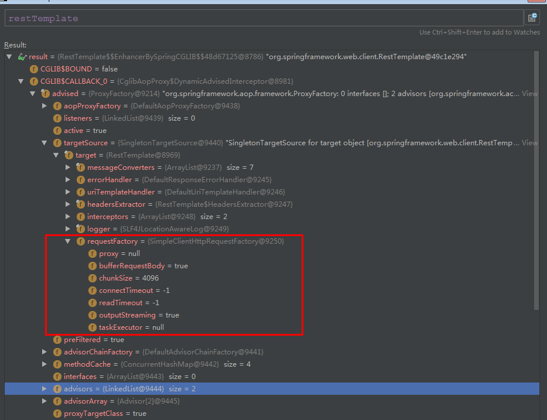

## ribbon 自动化配置的默认实现  RibbonClientConfiguration

## 在引入 SpringCloud Ribbon的依赖之后，就能够自动化构建下面这些接口的实现：
### IClientConfig ： ribbon 的客户端配置
默认采用 DefaultClientConfigImpl

### ribbon 参数配置的所有key属性及value类型的定义 通过查看 com.netflix.client.config.CommonClientConfigKey 类即可

http://javadox.com/com.netflix.ribbon/ribbon-core/2.0-RC4/com/netflix/client/config/DefaultClientConfigImpl.html#DEFAULT_MAX_HTTP_CONNECTIONS_PER_HOST
http://javadox.com/com.netflix.ribbon/ribbon-core/2.0-RC4/constant-values.html#com.netflix.client.config.DefaultClientConfigImpl.DEFAULT_MAX_HTTP_CONNECTIONS_PER_HOST

### IRule ： ribbon的负载均衡策略
默认采用 ZoneAvoidanceRule，该策略能够在多区域环境下选出最佳区域的实例进行访问。
### IPing ：ribbon的实例检查策略
默认采用 NoOpPing实现， 实际上它并不检查实例是否可用，默认认为所有服务实例都是可用的
### ServerList<T extends Server> ：服务实例清单的维护机制
默认采用 ConfigurationBasedServerList 也可以从配置中加载服务器列表的工具类
### ServerListFilter<T extends Server> ：服务实例清单过滤机制
默认采用 ZonePreferenceServerListFilter 该策略能够优先过滤出与请求调用方处于同区域的服务实例
### ILoadBalancer 负载均衡器
默认采用 ZoneAwareLoadBalancer 它具备了区域感知的能力


## 上面这些自动化配置内容仅在没有引入SpringCloud  Eureka等 服务治理框架时如此，在同时引入 Eureka 和 Ribbon 依赖时，自动化配置会有一些不同


### 替换 ribbon 默认的配置实现
- 创建对应的实例就能覆盖这些默认的配置实现

比如下面的配置内容，由于创建了 PingUrl 实例，所以默认的 NoOpPing 就不会被创建
```
  /**
     * 替换默认的 NoOpPing 
     * @param clientConfig
     * @return
     */
    @Bean
    public IPing ribbonPing(IClientConfig clientConfig) {
        return new PingUrl();
    }
```

- 通过 @RibbonClient 注解来实现更细粒度的客户端配置
```
Client除了包括已经存在于 RibbonClientConfiguration 的组件，也包括了自定义的 HelloServiceConfiguration（一般后者会重载前者）。
警告：HelloServiceConfiguration 不能被 @ComponentScan 所扫描。
如果被扫描了，这样的话，它将被所有 @RibbonClients共享。

如果你使用 @ComponentScan (or @SpringBootApplication) ，你需要避免它被包括其中。
(例如：将它放到一个独立的，无重叠的包里，或者指明不被 @ComponentScan扫描)。

HelloServiceConfiguration.class 需要被 @Configuration 修饰

com.zhang
    |--config 自定义ribbon 配置类，并用 @Configuration 修饰
    |--cache
        |--web
        |-- ribbon 引用 配置类，也就是下面的代码
        |--main 函数
            
@Configuration
@RibbonClient(name = "hello-service", configuration = HelloServiceConfiguration.class)
public class RibbonClientConfiguration {

}
```
### RibbonClient 配置的优化
在Brixton版本中对 RibbonClient的IPing、IRule 等接口实现进行个性化定制的方法，主要通过独立创建
一个 Configuration 类来定义IPing、 IRule等接口的具体实现Bean,
然后在创建 RibbonClient 时指定要使用的具体 Configuration 类来覆盖自动化配置的默认实现.

但是当有大量这类配置的时候，对于各个 RibbonClient 的指定配置信息都将分散在这些配置类的注解定义中，这使得管理和修改都变得非常不方便.
所以 在 Camden版本中， Spring Cloud Ribbon 对 RibbonClient 定义个性配置的方法做了进一步优化。
可以直接通过 `<clientName>.ribbon.<key> = <value> ` 的形式进行配置，

比如将 hello-service 服务客户端的 IPing接口 实现替换为 PingUrl

在application.properties 配置中增加下面的内容即可
```
hello-service.ribbon.NFLoadBalancerPingClassName = com.netflix.loadbalancer.PingUrl
```

在 Camden 版本中，Spring Cloud Ribbon 新增了一个 org.springframework.cloud.netflix.ribbon.PropertiesFactory
类来动态地为 RibbonClient 创建这些接口实现。

- 使用properties定制化Ribbon Client
> 从1.2.0开始，Spring Cloud Netflix支持使用 properties来定制化 Ribbon clients

支持的属性如下（加上.ribbon.的前缀）:    

    - NFLoadBalancerClassName: 配置 ILoadBalancer 接口的实现
    - NFLoadBalancerRuleClassName: 配置 IRule 接口的实现
    - NFLoadBalancerPingClassName: 配置 IPing 接口的实现
    - NIWSServerListClassName: 配置 ServerList 接口的实现
    - NIWSServerListFilterClassName： 配置 ServerListFilter 接口的实现
    
    在这些属性中定义的 Classes 优先于在 @RibbonClient(configuration=MyRibbonConfig.class)
    定义的beans和由Spring Cloud Netflix提供的缺省值。
```
<clientName>.ribbon.<key>=<value>
hello-service.ribbon.NFLoadBalancerPingClassName=com.netflix.loadbalancer.PingUrl
```


### 参数配置
对千Ribbon的参数配置通常有两种方式：
- 全局配置
- 客户端配置

### 全局配置
```
<key>代表了Ribbon客户端配置的参数名
ribbon.<key>=<value>

全局配置Ribbon创建连接的超时时间
#请求连接的超时时间  http 建立 socket 超时时间
ribbon.ConnectTimeout=250
#请求处理的超时时间  http 读取响应 socket 超时时间
ribbon.ReadTimeout=1000

```

### ribbon 客户端配置 
全局配置可以作为默认值，当指定客户端配置了相应的key值时，将覆盖全局配置的内容。

<clientName>代表了客户端的名称,如 @RibbonClient 中指定的名称，
也可以将它理解为是一个服务名。

```
<clientName>.ribbon.<key>=<value>

<clientName>:代表客户端的名称

如调用 restTemplate.getForEntity("http://hello-service/hello",String.class)时
如果没有服务治理框架的帮助，我们需要为该客户端指定具体的实例清单，如下配置
hello-service.ribbon.ListOfServers=localhost:8001,localhost:8002
```

### 与 eureka 结合 ribbon 的自动化配置类 EurekaRibbonClientConfiguration
当同时引入 riboon 与 eureka依赖时，会触发 eureka 中实现的对 ribbon 的自动化配置，
- ServerList<T extends Server>的维护机制实现将被 DiscoveryEnabledNIWSServerList 的实例所覆盖，
  该实现会将服务清单列表交给 Eureka 的服务治理机制来进行维护。
- IPing 的实现将被 NIWSDiscoveryPing 的实例所覆盖，
  该实现也将实例检查的任务交给了服务治理框架来进行维护。
- 获取实例 ServerList 的接口实现将采用 DomainExtractingServerList，
  其目的是为了让实例维护策略更加通用，所以将使用物理元数据来进行负载均衡而不是使用原生的AWS AMI元数据。
- 因为 spring cloud ribbon 默认实现了区域亲和策略，可以能过eureka 实例的元数据配置来实现区域化的实例配置方案
  比如：将处于不现机房的实例配置配置成不同的区域值，以作为跨区域的容错机制的实现 在服务实例的元数据中增加 zone参数 来指定
  自已所在的区域  eureka.instance.metadata-map.zone=shanghai
- 指定客户端的配置方式可以直接使用  Eureka 中的服务名用为 `<clientName>`来完成针对各个微服务的个性化配置
- 也可以禁用 Eurkea 对 Ribbon 服务实例的维护实现 `ribbon.eureka.enabled=false`,并通过
  `<clientName>.ribbon.ListOfServers=localhost:8001` 进行设置服务实例的配置。
  

### 重试机制
spring cloud eureka 实现的服务治理机制强调了CAP原理中的A(可用性)P(可靠性),而ZooKeeper强调C(一致性)P(可靠性)
eureka 为了实现更高的服务的可用性，牺牲了一定的一致性，在极端情况下它宁愿接受故障实例也不要丢掉 健康 实例。
比如：eureka 会因超过 85%的实例丢失心跳而会触发保护机制。注册中心将会保留此时的所有节点。
以实现服务间依然可以进行互相调用的场景，即使其中有部分故障节点，但这样做可以继续保障大多数的服务正常消费。

不论是由于触发了保护机制还是服务剔除的延迟，引起服务调用到故障实例的时候我们还是希望能够增强对这类问题
的容错。所以，我们在实现服务调用的时候通常会加入一些重试机制。

Spring cloud 下整合了 spring retry来增强 RestTemplate的重试能力，通过配置，原来那些通过 RestTemplet 实现的服务访问
就会自动根据配置来实现重试策略。

- 查看 LoadBalancerRetryProperties 类看开启重试配置属性。
- 查看 RetryLoadBalancerInterceptor 类，对 RetryTemplate 进行重试处理。
- 查看 LoadBalancerAutoConfiguration 类对 RetryLoadBalancerInterceptor 进行实例化。


当访问到故障请求的时候，它会再尝试访问一次当前实例(MaxAutoRetries 配置)，
如果不行，就换个实例进行访问，如果还不行，就再换一次实例访问(MaxAutoRetriesNextServer 配置)，
如果依然不行，返回失败信息。
>对于当前实例的访问次数 由 MaxAutoRetries 参数决定。  
对于实例的切换的次数 由 MaxAutoRetriesNextServer 参数决定。

Ribbon+RestTemplate 的重试

```

RestTemplate 配置
@Bean
@LoadBalanced
public RestTemplate restTemplate() {
  SimpleClientHttpRequestFactory simpleClientHttpRequestFactory 
     = new SimpleClientHttpRequestFactory();
  simpleClientHttpRequestFactory.setConnectTimeout(1000);
  simpleClientHttpRequestFactory.setReadTimeout(1000);
  return new RestTemplate(simpleClientHttpRequestFactory);
}

属性配置
#开启重试机制  
spring.cloud.loadbalancer.retry.enabled=true
#对所有操作请求都进行重试
hello-service.ribbon.OkToRetryOnAllOperations=true
#切换实例的重试次数,(重试负载均衡其他的实例最大重试次数，不包括首次 server)
hello-service.ribbon.MaxAutoRetriesNextServer=2
#对当前实例的重试次数,(同一台实例最大重试次数，不包括首次调用)
hello-service.ribbon.MaxAutoRetries=1
```

### 跟踪 RestTemplate 的具体实现
connectTimeout=-1  和 readTimeout =-1 说明没有设置超时时间和处理时间 
所以 以下配置是无效，这也导致了没有重试的原因
```
#请求连接的超时时间  http 建立 socket 超时时间
HELLO-SERVICE-1.ribbon.ConnectTimeout=250
#请求处理的超时时间  http 读取响应 socket 超时时间
HELLO-SERVICE-1.ribbon.ReadTimeout=1000
``` 

所以要在初始化 RestTemplate时设置时间

```
    @LoadBalanced
    @Bean
    public RestTemplate restTemplate() {
        // Ribbon+RestTemplate的重试
        SimpleClientHttpRequestFactory httpComponentsClientHttpRequestFactory
                = new SimpleClientHttpRequestFactory();
        httpComponentsClientHttpRequestFactory.setConnectTimeout(1000);
        httpComponentsClientHttpRequestFactory.setReadTimeout(1000);
        RestTemplate rt = new RestTemplate(httpComponentsClientHttpRequestFactory);
        return rt;
    }
```

查看 RestTemplate 是具体实现




### 重试配置参考资料
https://my.oschina.net/eacdy/blog/1581309   
https://my.oschina.net/sean1989/blog/904016   
http://www.itmuch.com/spring-cloud-sum/spring-cloud-retry/


### 自动化置类加载顺序
EurekaClientAutoConfiguration ==>> RibbonAutoConfiguration ==>> LoadBalancerAutoConfiguration

EurekaRibbonClientConfiguration

### ribbon重试相关类实例查看 RibbonAutoConfiguration、LoadBalancerAutoConfiguration、RetryAutoConfiguration
- 负载均衡器重试工厂接口
  
  LoadBalancedRetryPolicyFactory  实现类  RibbonLoadBalancedRetryPolicyFactory
  
- RetryTemplate  承担了重试执行者的角色，重试请求的执行和定义 模板类 

- RetryLoadBalancerInterceptor  带重试机制的负载均衡拦截器
  
  所有的请求都会被 intercept 函数所拦截
  
RetryTemplate 起请求，并RetryLoadBalancerInterceptor拦截器所拦截，
拦截器对请求添加带 重试的策略 RibbonLoadBalancedRetryPolicyFactory，
RibbonLoadBalancedRetryPolicyFactory 创建一个 LoadBalancerRequest 对象 
交给 RibbonLoadBalancerClient 的execute函数执行请求

###Spring retry相关接口
- RetryCallback: 封装你需要重试的业务逻辑（上文中的doSth）
- RecoverCallback：封装在多次重试都失败后你需要执行的业务逻辑(上文中的doSthWhenStillFail)
- RetryContext: 重试语境下的上下文，可用于在多次Retry或者Retry 和Recover之间传递参数或状态（在多次doSth或者doSth与doSthWhenStillFail之间传递参数）
- RetryOperations : 定义了“重试”的基本框架（模板），要求传入RetryCallback，可选传入RecoveryCallback；
- RetryListener：典型的“监听者”，在重试的不同阶段通知“监听者”（例如doSth，wait等阶段时通知）
- RetryPolicy : 重试的策略或条件，可以简单的进行多次重试，可以是指定超时时间进行重试（上文中的someCondition）
- BackOffPolicy: 重试的回退策略，在业务逻辑执行发生异常时。如果需要重试，我们可能需要等一段时间(可能服务器过于繁忙，如果一直不间隔重试可能拖垮服务器)，当然这段时间可以是0，也可以是固定的，可以是随机的（参见tcp的拥塞控制算法中的回退策略）。回退策略在上文中体现为wait()；
- RetryTemplate :RetryOperations的具体实现，组合了RetryListener[]，BackOffPolicy，RetryPolicy。
 


```
DynamicServerListLoadBalancer for client HELLO-SERVICE initialized:
DynamicServerListLoadBalancer:{NFLoadBalancer:name=HELLO-SERVICE,
current list of Servers=[192.168.75.1:hello-service:8081, 192.168.75.1:hello-service:8082],
Load balancer stats=Zone stats: {defaultzone=[Zone:defaultzone;	Instance count:2;	
Active connections count: 0;	Circuit breaker tripped count: 0;	Active connections per server: 0.0;]},
Server stats: [[Server:192.168.75.1:hello-service:8082;	Zone:defaultZone;	Total Requests:0;	
Successive connection failure:0;	Total blackout seconds:0;	Last connection made:Thu Jan 01 08:00:00 CST 1970;	
First connection made: Thu Jan 01 08:00:00 CST 1970;	Active Connections:0;	
total failure count in last (1000) msecs:0;	
average resp time:0.0;	
90 percentile resp time:0.0;	
95 percentile resp time:0.0;	
min resp time:0.0;	max resp time:0.0;	
stddev resp time:0.0]
, [Server:192.168.75.1:hello-service:8081;	Zone:defaultZone;	
Total Requests:0;	Successive connection failure:0;	
Total blackout seconds:0;	Last connection made:Thu Jan 01 08:00:00 CST 1970;	
First connection made: Thu Jan 01 08:00:00 CST 1970;	Active Connections:0;	
total failure count in last (1000) msecs:0;	average resp time:0.0;	
90 percentile resp time:0.0;	
95 percentile resp time:0.0;	
min resp time:0.0;	
max resp time:0.0;	
stddev resp time:0.0]
]}ServerList:org.springframework.cloud.netflix.ribbon.eureka.DomainExtractingServerList@31ea5b91
```
```
c.example.ribbon.web.ConsumerController  :
clientConfig:
 ClientConfig:
 MaxAutoRetries:0, 
 PoolKeepAliveTimeUnits:SECONDS, 
 Linger:null, 
 IsHostnameValidationRequired:null, 
 ProxyHost:null, 
 BackoffTimeout:null, 
 ConnectionPoolCleanerTaskEnabled:true, 
 FollowRedirects:false, 
 OkToRetryOnAllOperations:false, 
 MaxHttpConnectionsPerHost:50, 
 ProxyPort:null, 
 NFLoadBalancerRuleClassName:com.netflix.loadbalancer.AvailabilityFilteringRule, 
 EnableZoneExclusivity:false, 
 MaxTotalConnections:200, 
 EnableGZIPContentEncodingFilter:false, 
 UseIPAddrForServer:false, 
 NFLoadBalancerPingClassName:com.netflix.loadbalancer.DummyPing, 
 Port:7001, 
 MaxAutoRetriesNextServer:1, 
 TrustStorePassword:null, 
 ReadTimeout:5000, 
 MaxTotalHttpConnections:200, 
 listOfServers:, 
 NFLoadBalancerClassName:com.netflix.loadbalancer.ZoneAwareLoadBalancer, 
 KeyStore:null, 
 ReceiveBufferSize:null, 
 MinPrimeConnectionsRatio:1.0, 
 NIWSServerListFilterClassName:null, 
 Version:null, 
 PoolKeepAliveTime:900, 
 ConnectionManagerTimeout:2000, 
 VipAddress:null, 
 EnableConnectionPool:true, 
 TrustStore:null, 
 IsSecure:null, 
 EnableZoneAffinity:true, 
 InitializeNFLoadBalancer:null, 
 SecurePort:null, 
 ServerDownStatWindowInMillis:null, 
 PoolMinThreads:1,
 RequestIdHeaderName:null, 
 ServerDownFailureLimit:null, 
 KeyStorePassword:null, 
 TargetRegion:null, 
 NFLoadBalancerPingInterval:null, 
 PrioritizeVipAddressBasedServers:true, 
 DeploymentContextBasedVipAddresses:HELLO-SERVICE, 
 ForceClientPortConfiguration:null, 
 ClientClassName:com.netflix.niws.client.http.RestClient, 
 RequestSpecificRetryOn:null, 
 PoolMaxThreads:200, 
 GZipPayload:null, 
 AppName:null, 
 EnablePrimeConnections:false, 
 IsClientAuthRequired:false, 
 PrimeConnectionsURI:/, 
 CustomSSLSocketFactoryClassName:null, 
 PrimeConnectionsClassName:com.netflix.niws.client.http.HttpPrimeConnection, 
 ConnectTimeout:2000, 
 ConnIdleEvictTimeMilliSeconds:30000, 
 ServerListUpdaterClassName:null, 
 NFLoadBalancerMaxTotalPingTime:null, 
 MaxConnectionsPerHost:50, 
 IgnoreUserTokenInConnectionPoolForSecureClient:null,
 NIWSServerListClassName:com.netflix.loadbalancer.ConfigurationBasedServerList, 
 RulePredicateClasses:null, 
 ConnectionCleanerRepeatInterval:30000, 
 VipAddressResolverClassName:com.netflix.client.SimpleVipAddressResolver, 
 StaleCheckingEnabled:null, 
 SendBufferSize:null, 
 MaxTotalTimeToPrimeConnections:30000, 
 MaxRetriesPerServerPrimeConnection:9, 
 ServerListRefreshInterval:null, 
 EnableMarkingServerDownOnReachingFailureLimit:null
```

####D版本
您可能希望在响应中返回某些状态代码时重试请求。
您可以列出您希望Ribbon客户端使用属性clientName.ribbon.retryableStatusCodes重试的响应代码
```
clientName:
  ribbon:
    retryableStatusCodes: 404,502
```
您还可以创建一个类型为LoadBalancedRetryPolicy的bean，并实现retryableStatusCode方法来确定是否要重试发出状态代码的请求。

####Zuul
您可以通过将zuul.retryable设置为false来关闭Zuul的重试功能。
您还可以通过将zuul.routes.routename.retryable设置为false，以路由方式禁用重试功能。


##Ribbon是什么？
http://lxlong.iteye.com/blog/2314573

区域感知轮询负载均衡（ZoneAware）
区域感知负载均衡内置电路跳闸逻辑，可被配置基于区域同源关系（Zone Affinity，
也就是更倾向于选择发出调用的服务所在的托管区域内，这样可以降低延迟，节省成本）选择目标服务实例。
它监控每个区域中运行实例的行为，而且能够实时的快速丢弃一整个区域。这样在面对整个区域故障时，
帮我们提升了弹性。

com.netflix.loadbalancer.ZoneAwareLoadBalancer.setServerListForZones

com.netflix.loadbalancer.ZoneAwareLoadBalancer.chooseServer

负载平衡器规则，过滤出服务器:
com.netflix.loadbalancer.AbstractServerPredicate

##ribbon 负载均衡器实现
http://blog.csdn.net/forezp/article/details/74820899

LoadBalancerClient的实现类为RibbonLoadBalancerClient，这个类是非常重要的一个类，最终的负载均衡的请求处理，由它来执行
org.springframework.cloud.netflix.ribbon.RibbonLoadBalancerClient

choose()方法是选择具体服务实例的一个方法。该方法通过getServer()方法去获取实例，经过源码跟踪，最终交给了ILoadBalancer类去选择服务实例

LoadBalancer在ribbon-loadbalancer的jar包下,它是定义了实现软件负载均衡的一个接口，它需要一组可供选择的服务注册列表信息，以及根据特定方法去选择服务;

com.netflix.loadbalancer.ILoadBalancer
- addServers()方法是添加一个Server集合;
- chooseServer()方法是根据key去获取Server；
- markServerDown()方法用来标记某个服务下线;
- getReachableServers()获取可用的Server集合；
- getAllServers()获取所有的Server集合。

IClientConfig 用于对客户端或者负载均衡的配置，它的默认实现类为DefaultClientConfigImpl

IRule用于复杂均衡的策略，它有三个方法，
- 其中choose()是根据key 来获取server,
- setLoadBalancer()和getLoadBalancer()是用来设置和获取ILoadBalancer的

##IRule有很多默认的实现类
- BestAvailableRule 选择最小请求数
- ClientConfigEnabledRoundRobinRule 轮询
- RandomRule 随机选择一个server
- RoundRobinRule 轮询选择server
- RetryRule 根据轮询的方式重试
- WeightedResponseTimeRule 根据响应时间去分配一个weight ，weight越低，被选择的可能性就越低
- ZoneAvoidanceRule 根据server的zone区域和可用性来轮询选择